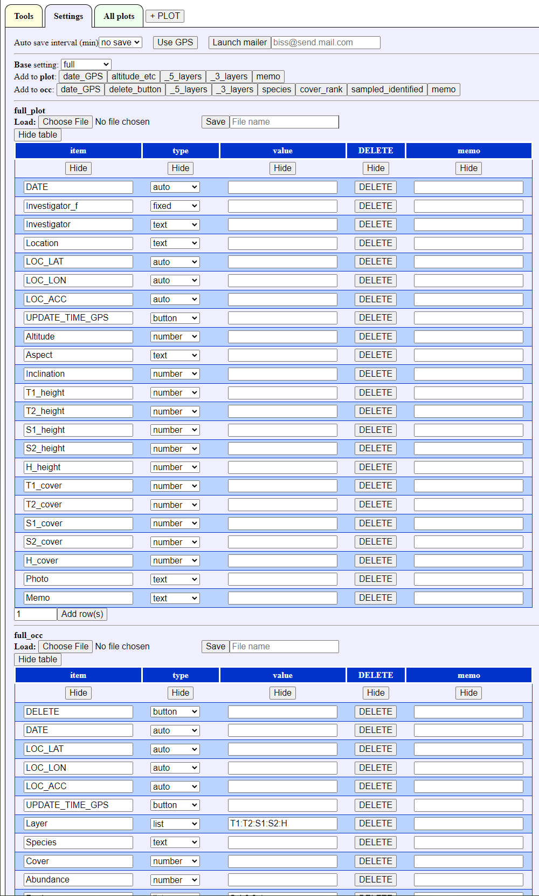
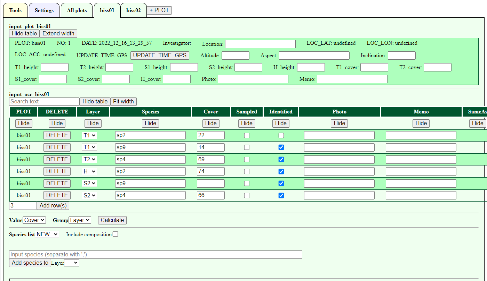
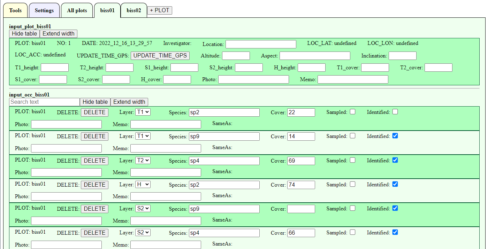
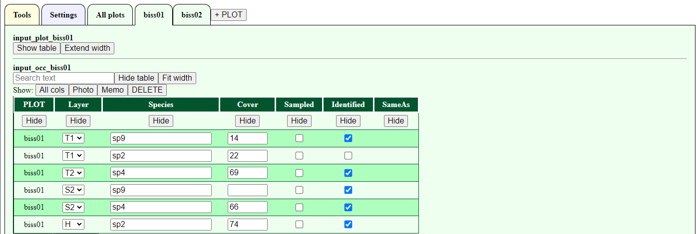
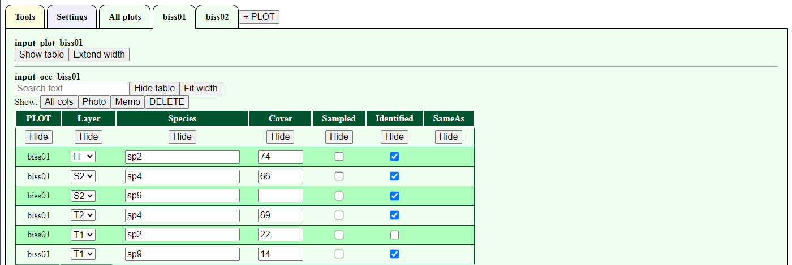
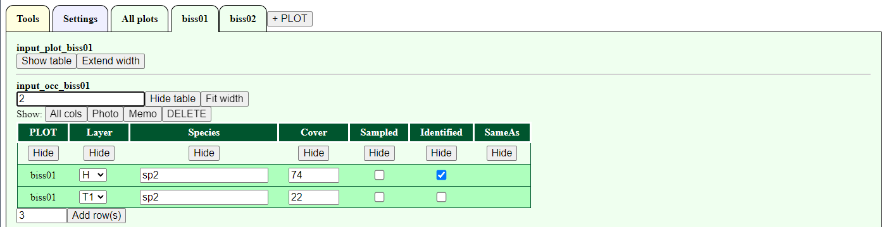

# Settings

## Initial settings

Initial settings is as below. 
Can use auto saving and select several setting for plots and occurrences data. 


## Change font size

To change the font size of the entire screen, click "small" and "LAGE" buttons.
The size can be changed by approximately 0.83 (1/1.2) and 1.2 times, respectively.


## Change to full screen

The browser is displayed in a normal window size at startup. 
To prevent accidental termination, full screen is recommended.
Click "FULL SC <=> windowed" to switch between full-screen and windowed mode.

## Use GPS

To use GPS data obtained by a tablet or computer, permission is required.
Click the "Use GPS" button, then a message for permission will be desplayed and click 'Allow'.
To stop GPS, click "Stop GPS".

## Launch mailer

Enter an e-mail address and click "Launch mailer" to start the default e-mail application.
The e-mail application can be set by your tablet or computer.

- Subject: biss\_yyyy\_mm\_dd\_hh\_mm\_ss    
- Body: Survey data in JSON format    

To use the data in R, save the body of the email as text data.
For the subsequent operations, see ["Inport data into R"](https://github.com/matutosi/biodiv/blob/main/man/howtouse.md#inport-data-into-r-1).

## Auto save

Data can be saved at a interval (1, 3, 5, 10, 15, 30, 60 minutes). 
To enable automatic saving, the following settings should be needed. 
This continues to save a new file periodically. 
Therefore, a large number of files are saved at short intervals. 
Generally, it is recommended to save at intervals of 10 or 15 minutes. 

### Select auto save intervals

Select auto save interval (minutes) form the pull-down menu.
After setting interval, all plots and occurrences data will be downloaded. 


### Downloading the first data

When set to 5-minute intervals, the first data will be downloaded 5 minutes after setting.
Directory for download depends on your browser settings.


### Allowing multiple file downloads

During the second download after 10 minutes, a warning message may appear about allowing multiple files download.
In this case, select "Allow".


### Auto saving data

Data is then downloaded according to the interval setting.


### Data format

- file name: biss\_yyyy\_mm\_dd\_hh\_mm\_ss.json   
- format: text file with UTF8 encoding   

example

> {"plot":{"PLOT":["biss01","biss02"],"NO":["1","2"],"DATE":["2022\_12\_08\_20\_56\_33","2022\_12\_08\_20\_56\_34"],"Investigator":["",""],"Location":["",""],"LOC\_LAT":["undefined","undefined"],"LOC\_LON":["undefined","undefined"],"LOC\_ACC":["undefined","undefined"],"Altitude":["",""],"Aspect":["",""],"Inclination":["",""],"T1\_height":["",""],"T2\_height":["",""],"S1\_height":["",""],"S2\_height":["",""],"H\_height":["",""],"T1\_cover":["",""],"T2\_cover":["",""],"S1\_cover":["",""],"S2\_cover":["",""],"H\_cover":["",""],"Photo":["",""],"Memo":["",""]},"occ":{"PLOT":["biss01","biss01","biss01","biss01","biss01","biss01","biss02","biss02","biss02","biss02","biss02"],"Layer":["T1","T2","T1","T1","S1","S1","S1","S1","H","H","T2"],"Species":["sp1","sp3","sp7","sp4","sp4","sp9","sp1","sp9","sp5","sp7","sp7"],"Cover":["18","89","57","76","","99","","11","65","74","99"],"Sampled":["false","false","false","false","false","false","false","false","false","false","false"],"Identified":["false","true","true","true","true","true","false","true","true","true","true"],"Photo":["","","","","","","","","","",""],"Memo":["","","","","","","","","","",""],"SameAs":["","","","","","","","","","",""]}}

### Inport data into R

See ["Inport data into R"](https://github.com/matutosi/biodiv/blob/main/man/howtouse.md#inport-data-into-r-1) to use data in R.

## Setting of input items

Before inputting data, the plot and occurrence items must be set.
The following three methods are available. 

- Select a basic combination and add/delete items (recommended)   
- Start with the empty and add items with button (recommended)   
- Setting all items by yourself (not recommended)   

### Select a basic combination

To select a basic combination and add/delete items, select the setting close to be used from pull-down menu.

- full: Contains all items that might be needed in a vegetation survey or flora survey   
- \_5\_layers: For vegetation survey with 5 layers (T1, T2, S1, S2, H)   
- \_3\_layers: For vegetation survey with 3 layers (T, S, H)   
- no\_layers: For vegetation survey without layers   
- flora: For flora survey   
- empty: Empty settings


For vegetation surveys, it is recommended to use "full" or "\_5\_layers". 
Delete unnecessary items with "DELETE" button. 



If you can not find what you need, add rows by clicking "Add rows" at the bottom. 
To add multiple rows, change the values on the left and press "Add rows". 


### Start with the empty and add with buttons

Start with the empty setting, select empty above. 
Add items with "date\_GPS" button etc. 


### Save/load settings

The settings of plots and occurrences can be separately saved and restored. 
To save, enter a file name in the text box to the right of the "Save" button and click the "Save" button. 
The saved file is a text file in JSON format (UTF8) with the extension "json". 


settigs of no_layers

> {"biss\_c\_names":["item","type","value","DELETE","memo"],"biss\_d\_types":["text","list","text","button","text"],"biss\_selects":[null,["auto","button","checkbox","fixed","list","text","number","","","","","","","","","","","","","","",""],null,null,null],"biss\_inputs":{"item":["DATE","Investigator","Location","LOC\_LAT","LOC\_LON","LOC\_ACC","UPDATE\_TIME\_GPS","Altitude","Aspect","Inclination","Height","Cover","Photo","Memo"],"type":["auto","fixed","text","auto","auto","auto","button","number","text","number","number","number","text","text"],"value":["","","","","","","","","","","","","",""],"DELETE":["DELETE","DELETE","DELETE","DELETE","DELETE","DELETE","DELETE","DELETE","DELETE","DELETE","DELETE","DELETE","DELETE","DELETE"],"memo":["","","","","","","","","","","","","",""]}}

settigs of flora

> {"biss\_c\_names":["item","type","value","DELETE","memo"],"biss\_d\_types":["text","list","text","button","text"],"biss\_selects":[null,["auto","button","checkbox","fixed","list","text","number","","","","",""],null,null,null],"biss\_inputs":{"item":["DATE","Investigator","Location","Memo"],"type":["auto","fixed","text","text"],"value":["","","",""],"DELETE":["DELETE","DELETE","DELETE","DELETE"],"memo":["","","",""]}}

To restore the saved settings, click the "Choose file" button to the right of "Laod" and select the saved file.

### Setting all items by yourself (not recommended)

> **Note**   
> All items can also be set manually.
> However, this is not recommended because it requires understandings of the system specifications.

Item details

- item: Item name   
  - Item names that cannot be changed: "DATE", "LOC\_LAT", "LOC\_LON", "LOC\_ACC", "UPDATE\_TIME\_GPS", "DELETE", "DATE", "Layer", "Species", "Identified", "SameAs".   
  - Disabled strings: numbers at the beginning   
  - Duplicate item names are not allowed.   
- type: Input type   
  - auto: Auto input (used by system), item name cannot be changed   
  - button: button (used by system), item name cannot be changed   
  - checkbox: Checkbox   
  - fixed: Fixed value text   
  - list: pull-down list   
  - text: Text box   
  - number: Numeric value   
- value: behavior depends on type   
  - checkbox: unchecked if empty, checked if input is present (text such as "checked" is recommended for clarity)  
  - fixed: content of fixed value   
  - list: pull-down menu item names separated by ":"    
  - number : the range of increase or decrease step, 1 will be set when empty or non-numeric    
  - text : width of text box, 20 when empty or non-numeric
- DELETE: button to delete a row (not related to the setting itself)   
- memo: memo for user (not related to setting itself)    

### Hide/Show setting tables

The setting tables can be set shown or hidden.
To avoid accidental change of the settings, it is recommended to hide them.

Press "Hide table" in the upper left corner to hide it.
When the table is hidden, press "Show table" to show it.


### Tips for setting items

The horizontal order (left/right) of items in input tables depend on the vertical order (up/down) in setting tables. 
To change the order, enter a numbr in the "memo" field and click on the column "memo". 
This will allow you to reorder the columns according to the number. 
Clicking again switches the ascending/descending order.

# Input plot and occurrence data

## Add a new plot

Before inputing plot and occurrence data, click "+ PLOT".


Enter the PLOT name in the pop-up window. 
Alphanumeric and Japanese characters can be used for the PLOT name. 

> **Warning**   
> Only spaces and "\_" (underscore) are not allowed.
> Duplicate PLOT names are not allowed.


After inputing PLOT name and click "OK", a new tab will be shown.


In the following sections, you can see how to input plot and occurrence data with example.

## Show example

Click "Show example" in the upper right corner to display example data.


The upper part of the table displays plot data and the lower part displays occurrence data.

## Contents of example data

- Settings of the plot and occurrence items: "\_5\_layers" (for vegetation survey with 5 layers).   
- Plots: 2 plots (BiSS01 and BiSS02)  
- Occurrences: Randomly displays the layers (T1, T2, S1, S2, H), species (sp1, sp2, ...) and cover (0-100). 



## Change and operate tables (common to plot and occurrence)

Can operate the table of plot and occurrence. 

- Show/hide the table   
- Change table width  
- Show/hide columns   
- Sort rows   
- Search input text   

### Show/hide the table

Both the plot and occurrence tables can be displayed or hidden.
To prevent accidental changes, it is recommended to hide the table.
Press "Hide table" in the upper left corner of the table to hide the table.


When the table is hidden, pressing "Show table" will show it.


### Change table width

The initial state of the plot table is wrapped to fit the screen width, while the occurrence table is extended to the right without wrapping.
Clicking on "Extend width" in the upper left corner of the table expands the width of the table without wrapping.


Clicking on "Fit width" will wrap the table to fit the screen width .



### Show/hide columns

In a no-wrap table, the "Hide" button appears in the second row.
Clicking the "Hide" button hides the column.
The hidden column names are displayed at the top of the table following "Show:".
Clicking the button for each column name allows the column to be displayed again.
Click "All cols" to display all columns at once.


### Sort rows

Clicking on a column name in the "no wrap" table allows sorting according to the input contents of the column.
Lists such as layer are sorted to the order of settings.



Clicking the column name again switches the ascending or descending order.



Note that sorting is meaningless for the plot data, since there is only one row.

### Search input text

Entering text in the text box in the upper left corner of the table allows you to search for text inputs.
Only matched rows are displayed, so you can check the species name etc.



The search targets here are the text boxes and fixed value text in the displayed columns.
To exclude the name of a plot from the search, you can hide it by clicking "Hide".


## Input data

- Textbox: Enter text, e.g., species name   
- Checkbox: Check "Identified ets.     
- Numer: Enter a number or up and down number by up and down buttons by step. The step are set by setting. Decimal points can be entered using the keyboard.    
- Auto-fill items: "PLOT", "NO", "DATE", "LOC".    
- DATE", "LOC\_LAT", "LOC\_LON" and "LOC\_ACC" are updated by pressing "UPDATE\_TIME\_GPS" button.     


## Add/delete rows in a occurrence table

When a new location is added with "+ PLOT", 4 lines of occurrence rows are displayed.
Select the number of rows from the pull-down number in the lower left corner, 
and click "Add rows" to add a new input row.


## Add species from a list

The registered list is displayed as the pull-down menu below the occurrence table.
Select the list to use, and the names of the species in the list will be displayed.
See [Small species lists](https://github.com/matutosi/biodiv/blob/main/man/howtouse.md#small-species-lists) in the Tools menu, to register or delete a species list.


Click on a species name button in the list, the name is moved to the upper part of the list as a temporary registration.
The temporary registered species is not clickable in the list below.
Clicking on a temporary registered species button cancels the temporary registration.

Select a layer (if you need) to add from the pull-down menu.
Species names that do not exist as a button can be registered with the text box.
When registering multiple species in the text box, separate them with "," (comma).


Click "Add Species to" to add the species name to the occurrence table.
The temporary registered species will be returned to the species list.


If "Include composition" is checked, the names of species that have already been entered for all sites are added to the list.
Unidentified species (those not checked in "Identified") will be displayed with the name of the site in a format such as "sp8\_biss02".


If you select "sp8\_biss02" and add it to the occurrence table, the existing location name ("biss02" in this example) will automatically be entered in the "SameAs" column.


## Calculate cover in each layer

Select "Cover" for "Value" and "Layer" for "Group" in the lower left of the occurrence table, 
and click "Calculate" to display the result of calculating sum of cover for each layer.
Note that "Value" displays number items and "Group" displays pull-down list in the occurrence data. 
Thus, it is possible to calculate other than "Cover" and "Layer".


# Show all input data

The "All Plots" tab shows all the data: all of the plots, occurrence and composition tables, 
which allow for comparison among plots.
Note that the "All Plots" tables can only be viewed, and its contents cannot be changed.
Nothing will be shown before inputting data.


All tables in "All Plots" allow the following operations, as well as the tables of plots and occurrence data.

- Show/hide the table   
- Change table width  
- Show/hide columns   
- Sort rows   
- Search input text   

See "" for details.
["Change and operate tables"](https://github.com/matutosi/biodiv/blob/main/man/howtouse.md#change-and-operate-tables-common-to-plot-and-occurrence)

> **Note**   
> "All Plots" data is used for auto-saving. 

# Tools to find species

You can search for species names and input species with searched species or species list.
You can use multiple small species lists and one larg species list.


## Small species lists

A small list of species is intended to be displayed all in a screen, about 100 to 200 species, which can be visually confirmed.
It is useful to register frequent species.
Multiple species lists can be registered, so you can switch them.
The selected list is displayed in alphabetical order.
Selecting a species displayed in the list allows you to enter it as occurrence data.


### Load and register a species list from a file

> **Warning**   
> LocalStorage of the browser is used to store the species list.
> The information in LocalStorage can be "easily" leaked to others when browsing the site.
> Therefore, personal information should not be stored in the species list (LocalStorage).

Species names can be registered from a text file (UTF8).
In the text file, enter one species name per line.
Select a file name from the "Choose file" menu to the right of "Add species to list" and click "Open".

When registered as a species list, it will be added in the pull-down menu on the right side of the "Species list".

example(abc.txt)

> **Note**   
> The scientific and Japanese names in the following data do not match.

Adansonia digitata<br>
Adansonia grandidieri<br>
Adansonia gregorii<br>
Adansonia madagascariensis<br>
Adansonia perrieri<br>
Adansonia rubrostipa<br>
Adansonia suarezensis<br>
Adansonia za<br>

### Delete a species list

Select a species name list from the pull-down menu to the right of "DELETE" and click the "DELETE" button.


### Use a small species list

The registered list is displayed as the pull-down menu.
Select the list to use, and the names of the species in the list will be displayed.


Click on a species name button in the list, the name is moved to the upper part of the list as a temporary registration.
The temporary registered species is not clickable in the list below.
Clicking on a temporary registered species button cancels the temporary registration.


Change the number to the right of "No. of cols" to change the number of columns displaying the species name.


Select a PLOT and a layer from the pull-down menu. 
The pull-down menu displays a list of items such as layer.
Species cannot be added to more than one PLOT or layer at one time.
Selecting a PLOT is required, while not layer etc are not required.

Species names that do not exist as a button can be registered with the text box.
When registering multiple species in the text box, separate them with "," (comma).


Click "Add Species to" to add the species name to the occurrence table.
The temporary registered species will be returned to the species list.

When "Include composition" is checked, the names of species that have already been entered for all sites are added to the species list.
Unidentified species (those not checked in "Identified") will be displayed with the name of the site in a format such as "sp8\_biss02".


If you select "sp8\_biss02" and add it to the occurrence table, the existing location name ("biss02" in this example) will automatically be entered in the "SameAs" column.

## Large species lists

A large species list is assumed to be 1000 species or more in size.
It is useful to register all species that are likely to occur, although they occur infrequently.
In other words, it is better to register a list of all species in the country or region where you investigate.
Only one species list can be registered, and the file must be reloaded to switch.
The list of registered species is not displayed on the screen when it is only loaded.
A list of species that match the search in the text box will be displayed.
Selecting a species displayed allows you to enter it as occurrence data.

### Register a large species list

Species names can be registered from a text file (UTF8).
In the text file, enter one species name per line.
Select a file name from the "Choose file" menu to the right of "Add species to list" and click "Open".


Only one large list of species names can be registered, so when a new one is registered, the old one is deleted.

### Search species from a large list

A large species list can be searched by text string.
Enter a search string in the text box labeled "Input text" and click "Search" to display a button with the species name that matches the search results.
If there are more than 200 matches, a pop-up window will appear with the warning "Over 200 matches, showing 200 matches" and only the first 200 matches will be displayed.


Multiple character strings separated by spaces can be entered to narrow down the search (more than three items can be searched).
A search for "aaa bbb" will display only those matching the words "aaa" and "bbb".
If the search text box is left blank and "Search" is clicked, the search results will be reset and the species name button will disappear.


The input method for the occurrence data is the same as for the small species list.

# Inport data into R

[Data format](https://github.com/matutosi/biodiv/blob/main/man/howtouse.md#data-format) in BiSS is a text file (UTF8) in JSON format.
To use the data in R, it is convenient to use read_biss().

```{r, eval=FALSE}
read_biss <- function(json, join = TRUE){
  biss <- jsonlite::fromJSON(json)
  plot <- data.frame(biss$plot)
  occ  <- data.frame(biss$occ)
  if(join){
    return(dplyr::left_join(plot, occ))
  }else{
    return(list(plot = plot, occ = occ))
  }
}

library(jsonlite)
url <- "https://raw.githubusercontent.com/matutosi/biodiv/main/man/example.json"
json <- readr::read_tsv(url, col_names = FALSE)$X1

read_biss(json)
read_biss(json, join = FALSE)

```
