# 設定

## 初期画面

初期画面は以下のとおり．
自動保存や地点・観察の入力項目の設定が可能である．


## 文字サイズの変更

「small」「LAGE」ボタンで画面全体の文字サイズの変更が可能．
それぞれ，約0.83(1/1.2)倍・約1.2倍になる．


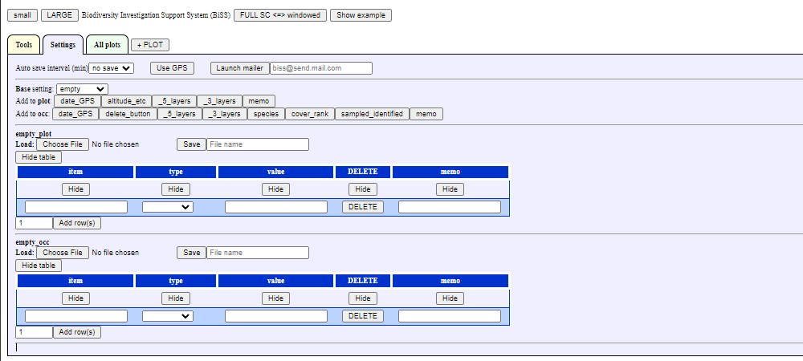

## 全画面表示への変更

起動時のブラウザは，通常のウィンドウ表示である．
誤操作によるアプリの終了を防ぐには，全画面表示を推奨．
「FULL SC <=> windowed」をクリックすると，ウィンドウ表示と全画面表示が入れ替わる．

## GPSの使用

端末で取得したGPS情報を入手するにはGPSの使用許可が必要．
「Use GPS」のボタンをクリックするとメッセージが表示されるので，「承諾」をクリックする．
GPSの使用を終了するには，「Stop GPS」をクリック．

## 電子メールアプリの起動

電子メールアドレスを入力し，「Launch mailer」をクリックすると既定の電子メールアプリを起動できる．
既定の電子メールアプリは，端末で設定する．

- 件名: biss\_yyyy\_mm\_dd\_hh\_mm\_ss    
- 本文: JSON形式の調査データ    

調査データをRで利用するには，メールの本文をテキストデータとして保存する．
その後の操作は，[「Rでのデータの取り込み」](https://github.com/matutosi/biodiv/blob/main/man/howtouse.md#inport-data-into-r-1)を参照．

## 自動保存

一定間隔(1,3,5,10,15,30,60分)で入力したデータを保存できる．
自動保存を有効にするには，以下の設定が必要．
一定間隔で保存を新しいファイルの保存を続ける．
そのため，短い間隔の場合は多くのファイルが保存される．
一般的には，10分や15分間隔程度での保存を推奨．

### 保存間隔の選択

自動保存の間隔(分)をプルダウンメニューから選択する．
保存間隔を設定すると，地点情報と観察情報の全てがダウンロードされる．


### データのダウンロード開始

5分間隔に設定した場合は，設定の5分後に1回目のデータがダウンロードされる．ダウンロード先のフォルダは，ブラウザの設定による．


### 複数ファイルダウンロードの許可

2回目の10分後のダウンロード時に，複数ファイルのダウンロードの許可の警告が出る場合がある．
この場合は，「許可」を選択する．


### データの自動保存

その後，設定した間隔に従ってデータがダウンロードされる．


### データの形式

- ファイル名 :biss\_yyyy\_mm\_dd\_hh\_mm\_ss.json   
- 形式: text file with UTF8 encoding   

データ例

> {"plot":{"PLOT":["biss01","biss02"],"NO":["1","2"],"DATE":["2022\_12\_08\_20\_56\_33","2022\_12\_08\_20\_56\_34"],"Investigator":["",""],"Location":["",""],"LOC\_LAT":["undefined","undefined"],"LOC\_LON":["undefined","undefined"],"LOC\_ACC":["undefined","undefined"],"Altitude":["",""],"Aspect":["",""],"Inclination":["",""],"T1\_height":["",""],"T2\_height":["",""],"S1\_height":["",""],"S2\_height":["",""],"H\_height":["",""],"T1\_cover":["",""],"T2\_cover":["",""],"S1\_cover":["",""],"S2\_cover":["",""],"H\_cover":["",""],"Photo":["",""],"Memo":["",""]},"occ":{"PLOT":["biss01","biss01","biss01","biss01","biss01","biss01","biss02","biss02","biss02","biss02","biss02"],"Layer":["T1","T2","T1","T1","S1","S1","S1","S1","H","H","T2"],"Species":["sp1","sp3","sp7","sp4","sp4","sp9","sp1","sp9","sp5","sp7","sp7"],"Cover":["18","89","57","76","","99","","11","65","74","99"],"Sampled":["false","false","false","false","false","false","false","false","false","false","false"],"Identified":["false","true","true","true","true","true","false","true","true","true","true"],"Photo":["","","","","","","","","","",""],"Memo":["","","","","","","","","","",""],"SameAs":["","","","","","","","","","",""]}}

### Rへのデータの取り込み

Rでデータを使うには，[「Rでのデータの取り込み」](https://github.com/matutosi/biodiv/blob/main/man/howtouse.md#inport-data-into-r-1)を参照．

## 入力項目の設定

データ入力の前に，地点情報と観察情報の項目を設定する．
設定方法としては以下の3つがある．

- 基本的な組み合わせを選んで，追加・削除する(推奨)   
- 空の設定に必要な項目をボタンで追加する(推奨)   
- 全て自分で設定する(非推奨)   

### 基本的な組み合わせの選択

基本的な組み合わせを選んで追加・削除する場合，まず使用するものに近い設定を選ぶ．

- full: 植生調査や植物相調査で必要になりそうな項目を全て含む   
- \_5\_layers: 5階層(T1, T2, S1, S2, H)の植生調査用   
- \_3\_layers: 3階層(T, S, H)の植生調査用   
- no\_layers: 階層なしの植生調査用   
- flora: 植物相調査用   
- empty: 空の設定    

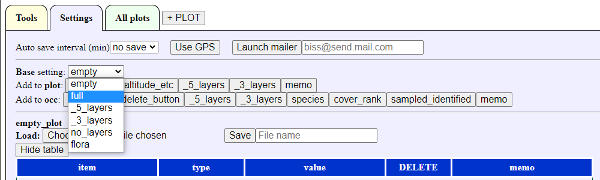

植生調査の場合は，「full」か「\_5\_layers」をもとにすることをおすすめする．
不要な行を「DELETE」で削除する．


必要な項目がない場合は，一番下の「Add rows」で行を追加する．
複数行を追加したい場合は，左の数値を変更してから「Add rows」を押す．

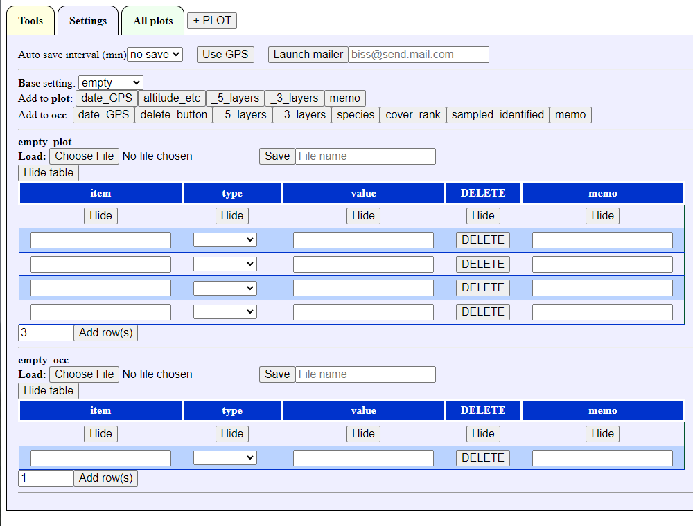

### 空の設定からボタンを追加

空の設定をもとに，必要な項目を追加する場合は，上記のemptyを選択する．
"date\_GPS"などのボタンで項目を追加する．

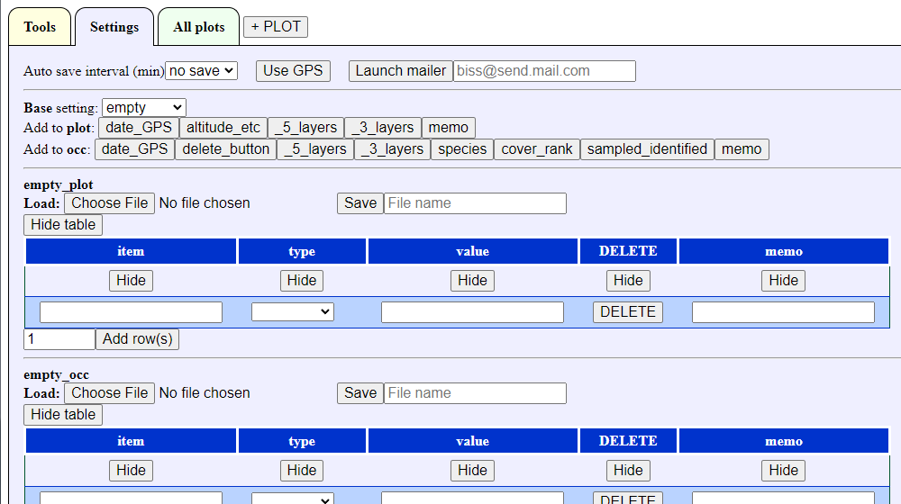
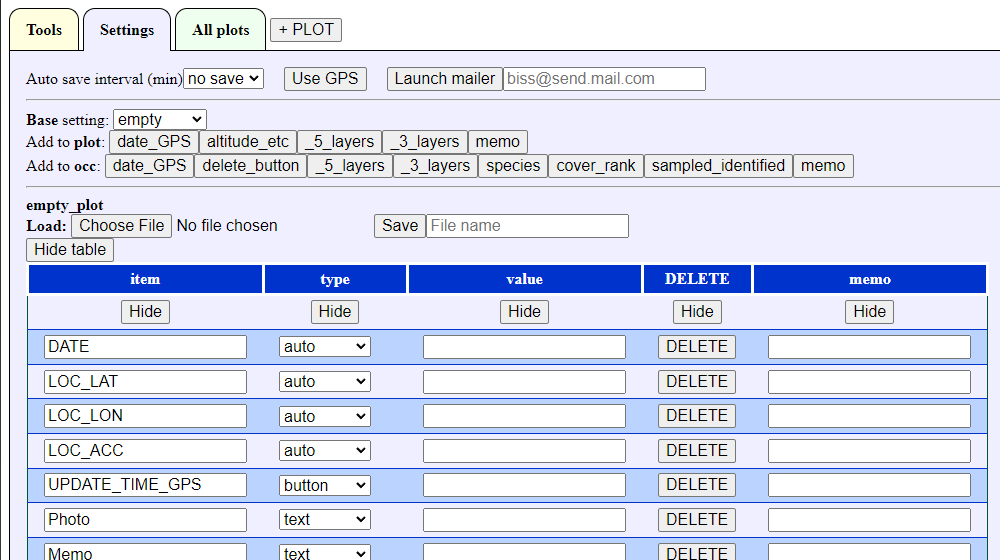

### 設定の保存・復元

地点項目と観察項目の設定は，個別に保存・復元可能．
保存するには「Save」の右にあるテキストボックスにファイル名を入力し，「Save」ボタンをクリックする．
保存したファイルはJSON形式のテキストファイル(UTF8)で，拡張子は「json」．


no_layersの設定

> {"biss\_c\_names":["item","type","value","DELETE","memo"],"biss\_d\_types":["text","list","text","button","text"],"biss\_selects":[null,["auto","button","checkbox","fixed","list","text","number","","","","","","","","","","","","","","",""],null,null,null],"biss\_inputs":{"item":["DATE","Investigator","Location","LOC\_LAT","LOC\_LON","LOC\_ACC","UPDATE\_TIME\_GPS","Altitude","Aspect","Inclination","Height","Cover","Photo","Memo"],"type":["auto","fixed","text","auto","auto","auto","button","number","text","number","number","number","text","text"],"value":["","","","","","","","","","","","","",""],"DELETE":["DELETE","DELETE","DELETE","DELETE","DELETE","DELETE","DELETE","DELETE","DELETE","DELETE","DELETE","DELETE","DELETE","DELETE"],"memo":["","","","","","","","","","","","","",""]}}

floraの設定

> {"biss\_c\_names":["item","type","value","DELETE","memo"],"biss\_d\_types":["text","list","text","button","text"],"biss\_selects":[null,["auto","button","checkbox","fixed","list","text","number","","","","",""],null,null,null],"biss\_inputs":{"item":["DATE","Investigator","Location","Memo"],"type":["auto","fixed","text","text"],"value":["","","",""],"DELETE":["DELETE","DELETE","DELETE","DELETE"],"memo":["","","",""]}}

保存した設定を復元するには，「Laod」の右側にある「Choose file」ボタンをクリックして，保存したファイルを選択する．

### 全項目を手動で設定(非推奨)

> **Note**   
> 全項目を手動で設定することも可能．
> ただし，システム仕様を理解する必要があるため，非推奨．

項目の詳細

- item: 項目名   
  - 変更不可の項目名: 「DATE」「LOC\_LAT」「LOC\_LON」「LOC\_ACC」「UPDATE\_TIME\_GPS」「DELETE」「DATE」「Layer」「Species」「Identified」「SameAs」   
  - 使用不可の文字列: 先頭での数字   
    <!-- 「,」「.」は不可? -->
  - 項目名の重複不可   
- type: 入力タイプ   
  - auto: 自動入力(システムで利用)，項目名の変更不可   
  - button: ボタン(システムで利用)，項目名の変更不可   
  - checkbox: チェックボックス   
  - fixed: 固定値のテキスト   
  - list: プルダウンリスト   
  - text: テキストボックス   
  - number: 数値   
- value: typeによって動作が異なる   
  - checkbox: 空のときはチェックなし，入力があるときはチェックあり(分かりやすくするため，「checked」などのテキストを推奨)  
  - fixed: 固定値の内容   
  - list: 「:」区切りでのプルダウンメニューの項目名   
  - number: 入力時の数値の増減幅，空の時や数値以外のときの増減幅は1
  - text: テキストボックスの幅，空の時や数値以外のときは20
- DELETE: 行の削除ボタン(設定自体には関係なし)   
- memo: 使用者用のメモ(設定自体には関係なし)    

### 設定表の表示・非表示

地点項目と観察項目の表は，表示/非表示の切り替えが可能．
それぞれを設定後に，間違えて設定を変更しないようにするには，非表示にしておくと良い．

表の左上ににある「Hide table」を押すと，非表示になる．
非表示のときに「Show table」を押すと，表示される．

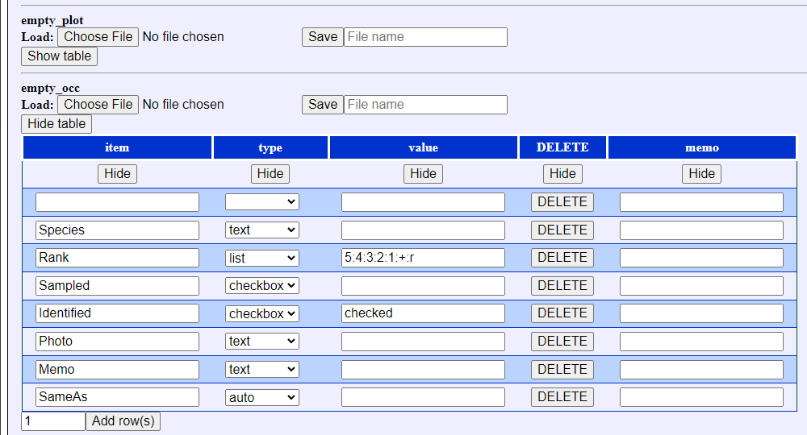

### 項目設定のコツ

調査データの入力表での横並びの順序(左右)は，設定表の縦並びの順序(上下)に従う．
順序を並べ替えたい場合は，入力表の項目「memo」に数値を入力してから列名の「memo」をクリックする．
そうすると，入力した数値の順序に並べ替え可能．
さらにクリックすると，昇順・降順が入れ替わる．

# 地点情報と観察情報の入力

## 新しい地点の追加

地点情報と観察情報を入力するには，まず「+ PLOT」をクリックする．

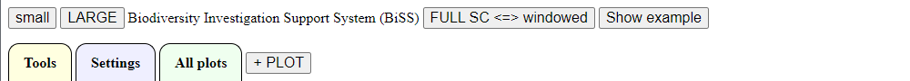

ポップアップ画面に地点名を入力する．
地点名には，英数字・日本語文字が使用可能．

> **Warning**   
> 空白のみや「\_」(アンダーバー)は使用不可．
> また，地点名の重複はできない．


地点名を入力して「OK」を選択すると，新しい地点のタブが表示される．

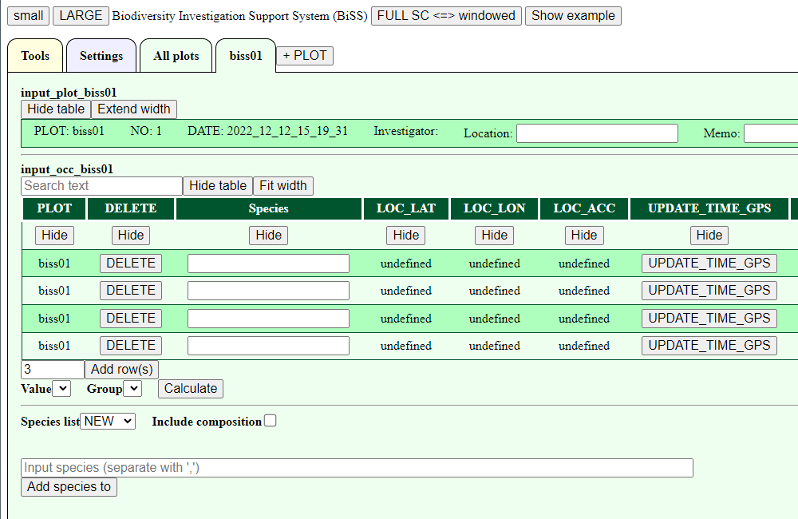

以下では，サンプルデータを用いて地点情報と観察情報の入力方法を説明する．

## サンプルデータの表示

右上にある「Show example」をクリックすると，サンプルデータが表示される．


表の上部には地点情報，下部には観察情報の表が表示される．

## サンプルデータの内容

- サンプルデータでの地点項目と観察項目: 「\_5\_layers」(5階層の植生調査用)．   
- Plots: BiSS01とBiSS02の2地点   
- Occurrences: ランダムに階層(T1, T2, S1, S2, H)，種名(sp1, sp2, ...)，被度(0-100)が表示される


## 表の表示変更・操作(地点・観察共通)

地点情報と観察情報の表は以下の操作が可能．

- 表の表示/非表示   
- 表幅の変更  
- 列の表示/非表示   
- 行の並べ替え   
- テキストデータの検索   

## 表の表示/非表示

地点情報と観察情報の両方とも，表示/非表示の切り替えが可能．
誤操作による変更を防ぐには，非表示にしておくと良い．
表の左上ににある「Hide table」を押すと，非表示になる．

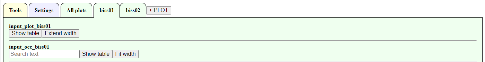

非表示のときに「Show table」を押すと，表示される．

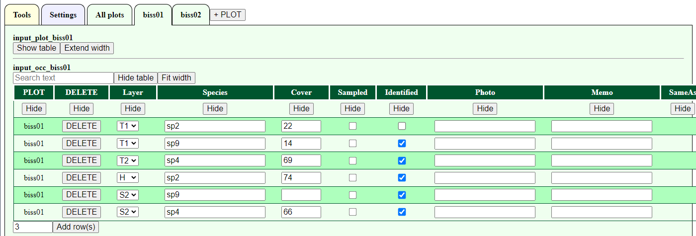

### 表幅の設定変更

地点情報の初期状態は画面幅に合わせた形で折り返され，観察情報は折り返しなしで右に伸びた状態である．
表の左上にある「Extend width」をクリックすると，表幅が広がって折り返しなしの状態になる．

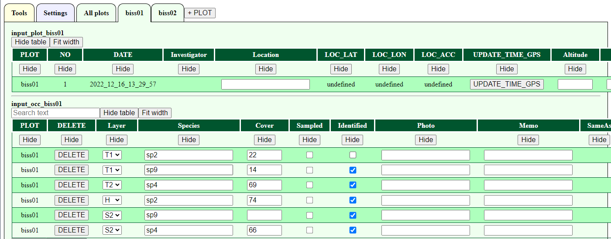

「Fit width」をクリックすると，画面幅で折り返される．


### 列の表示/非表示

折り返しなしの状態のとき，表の2行目に「Hide」ボタンが表示される．
「Hide」ボタンをクリックすると，その列が非表示になる．
非表示になった列は，表の上部に「Show:」に続いて列名がボタンとして表示される．
それぞれの列名のボタンをクリックすると，再表示が可能．
「All cols」をクリックすると全列を一斉に表示できる．


### 行の並べ替え

折り返しなしの状態のときに列名をクリックすると，その列の入力内容に従って並べ替えができる．
階層などのリストは設定時の入力順で並べ替えされる．


再度列名をクリックすると，昇順・降順が入れ替わる．


なお，1地点での地点情報では1行しかないため，並べ替えは無意味．

### テキストデータの検索

表の左上のテキストボックスに入力をすると，表示中の入力情報の検索が可能．
一致するものだけが表示されるため，種名の確認などができる．


なお，ここでの検索対象は，表示中の列のテキストボックス・固定値(fixed)のテキストである．
検索対象から地点名などを除外する場合は，「Hide」により非表示にしておくと良い．

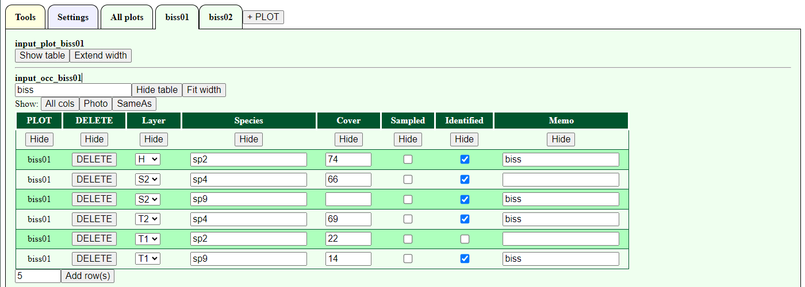
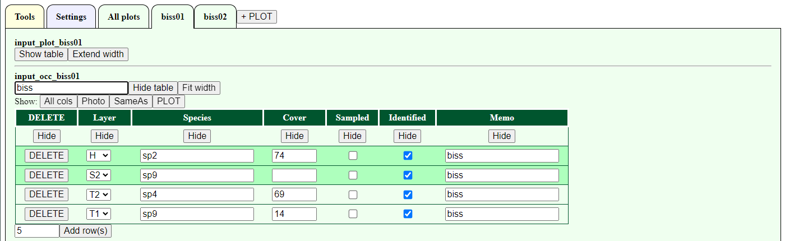

## データ入力

- Textbox: Enter text, e.g., species name   
- Checkbox: Check "Identified ets.     
- Numer: Enter a number or up and down number by up and down buttons by step. The step are set by setting. Decimal points can be entered using the keyboard.    
- Auto-fill items: "PLOT", "NO", "DATE", "LOC".    
- DATE", "LOC\_LAT", "LOC\_LON" and "LOC\_ACC" are updated by pressing "UPDATE\_TIME\_GPS" button.     
- テキストボックス: 種名などをテキストで入力     
- チェックボックス: 「Identified」(同定済み)などをチェック    
- 数値: 数値を入力．上下のボタンでも操作可能．増減間隔は設定で指定したもの．キーボードでは小数点以下の入力可能    
- 自動入力項目: 「PLOT」「NO」    
- 「DATE」「LOC\_LAT」「LOC\_LON」「LOC\_ACC」は，「UPDATE\_TIME\_GPS」ボタンを押と更新．GPSデータは，「StartGPS」ボタンを押してGPSデータの使用を許可する必要あり．     


## 観察情報の行の追加・削除

「+ PLOT」で新規の地点を追加すると，観察情報は4行の入力欄が表示される．
左下のプルダウンの数字で行数を選択して，「Add rows」をクリックすると，新たな入力行が追加できる．

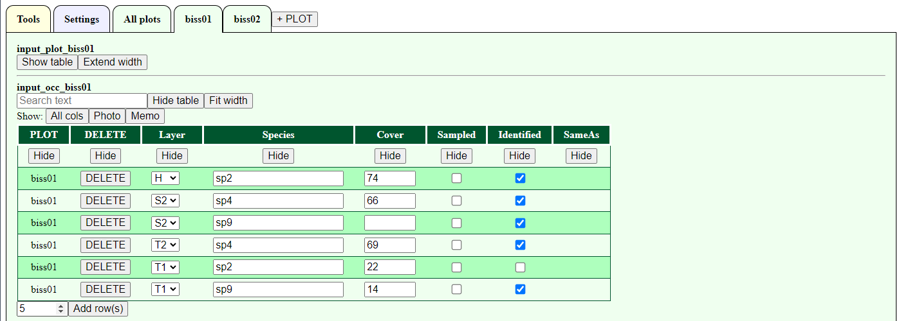
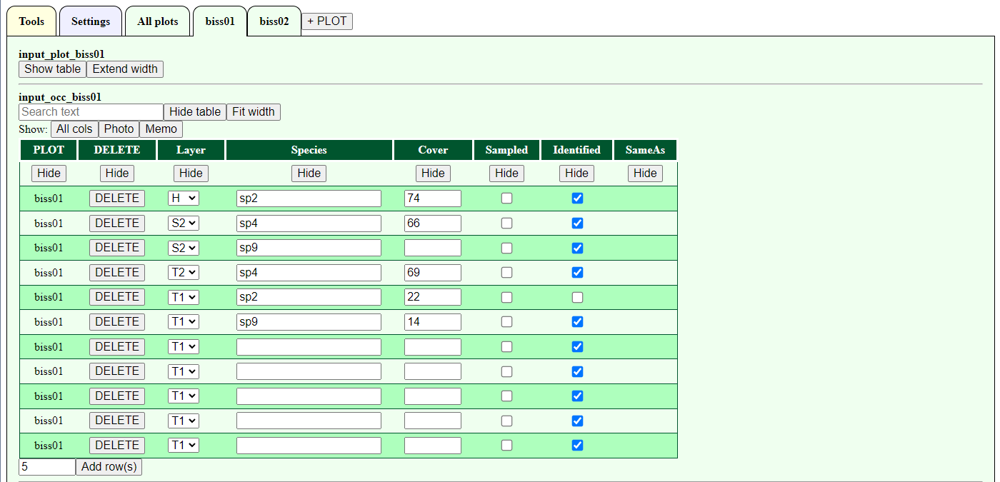

## リストから種名を追加

種名リストを登録しておくと，観察情報の表の下に種名一覧のプルダウンメニューにリスト名が表示される．
使用したいリストを選択すると，そのリストの種名が一覧として表示される．
なお，種名リストの登録・削除方法は，[小規模な種名リスト](https://github.com/matutosi/biodiv/blob/main/man/howtouse.md#small-species-lists)を参照．

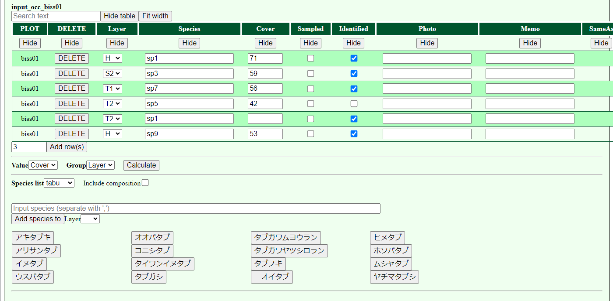

一覧に表示されている種名ボタンをクリックすると，その種名が仮登録として上の部分に移動する．
仮登録したものは，種名一覧ではクリックできなくなる．
仮登録した種名ボタンをクリックすると，仮登録がキャンセルされる．

仮登録した種名を登録したい階層等(階層は非必須)をプルダウンメニューから選択する．
種名ボタンのない種は，テキストボックスから登録可能．
テキストボックスで複数種を登録するときには「,」(半角カンマ)で区切る．


「Add Species to」をクリックすると種名が観察情報に追加できる．
種名リストの仮登録の種は，種名一覧に戻る．


「Include composition」にチェックを入れると，全地点での入力済の種名が種名一覧に追加される．
未同定の種名(「Identified」にチェックされていない種)には，「sp8\_biss02」のような形式で地点名が合わせて表示される．

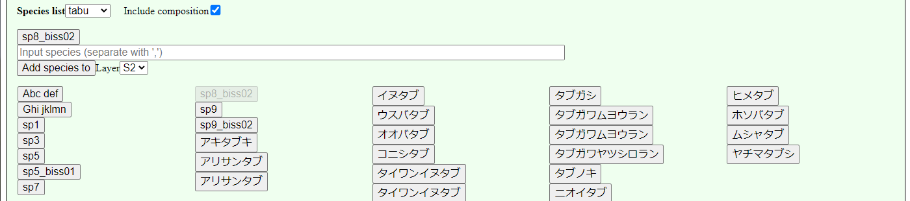

「sp8\_biss02」を選択して観察情報に追加すると，既出の地点名(この例では「biss02」)が「SameAs」の列にが自動的に入力される．


## 階層ごとの被度の計算

観察情報の左下にある「Value」に「Cover」，「Group」に「Layer」を選択して，「Calculate」をクリックすると，階層ごとの被度を計算した結果が表示される．
なお，「Value」には観察情報のうち数値の項目が表示され，「Group」にはプルダウンのリストの項目が表示される．
そのため，「被度」「階層」以外の集計も可能．


# 全入力情報の表示

「All Plots」のタブには，入力済みの全データが表示されている．
具体的には，全ての地点情報と観察情報である．
また，組成表形式の表も表示される．
これらによって，地点情報や地点間での観察情報の比較ができる．
なお，「All Plots」の表は閲覧のみで，内容の変更は不可．
また，未入力の場合は何も表示されない．


「All Plots」の3つの表のいずれも，地点情報や観察情報の表と同様に以下の操作が可能である．

- Show/hide the table   
- Change table width  
- Show/hide columns   
- Sort rows   
- Search input text   
- 表の表示/非表示   
- 表の幅の設定変更  
- 列の表示/非表示   
- 行の並べ替え   
- テキストデータの検索   

詳細は，[「表の表示変更・操作」](https://github.com/matutosi/biodiv/blob/main/man/howtouse.md#change-and-operate-tables-common-to-plot-and-occurrence)を参照．

> **Note**   
> 内部的なことではあるが，自動保存機能で保存しているのは「All Plots」のデータである．

# 種名ツール

種名の検索，種名リストからの登録などができる．
小規模な種名リストを複数および大規模な種名リストを1つ利用可能である．


## 小規模な種名リスト

小規模な種名リストは，一覧として常に表示できるぐらいの規模，つまり目視で確認可能な100-200種程度の利用を想定している．
高頻度で出現する種を登録しておくと便利である．
複数を登録できるため，必要に応じて切り替えが可能である．
選択したリストは，アルファベットあるいは50音順で表示される．
表示されたものを選択すると，調査データとして入力できる．

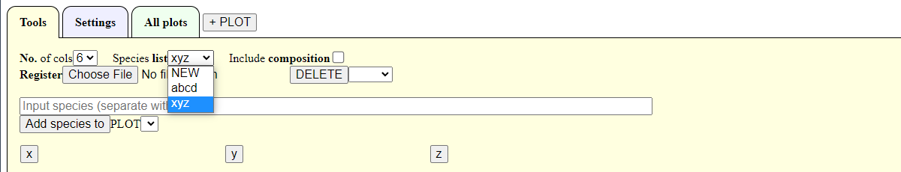

### ファイルから種名リストの登録

> **Warning**   
> 種名リストの保存にはブラウザのLocalStorageを利用している．
> LocalStorage内の情報は，ブラウザでのサイト閲覧時「容易に」他者に漏洩する可能性がある．
> そのため，通常保存することはないはずだが，個人情報等は種名リスト(LocalStorage)には保存するべきではない．

種名はテキストファイル(UTF8)から登録可能．
テキストファイルは，1つの種名を1行ごとに入力しておく．
「Add species to list」の右にある「Choose file」でファイル名を選択し，「開く」をクリックする．
テキストファイルの種名がボタン形式で表示される．

種名リストとして登録すると，「Species list」の右側にあるプルダウンメニュー内に追加される．

データ例(xyz.txt)

> **Note**   
> 以下の種名の学名と和名は対応していない．

アイ<br>
アイアシ<br>
アイグロマツ<br>
アイズイヌナズナ<br>
アイズシモツケ<br>
アイズスゲ<br>
アイダガヤ<br>
アイダクグ<br>

### 種名リストの削除

「DELETE」の右側にあるプルダウンメニューから種名リストを選択して「DELETE」ボタンをクリックすると，該当の種名リストが削除される．


### 種名リストの利用

登録した小規模な種名リストは，プルダウンメニューに表示される．
使用したいリストを選択すると，そのリストの種名が一覧として表示される．

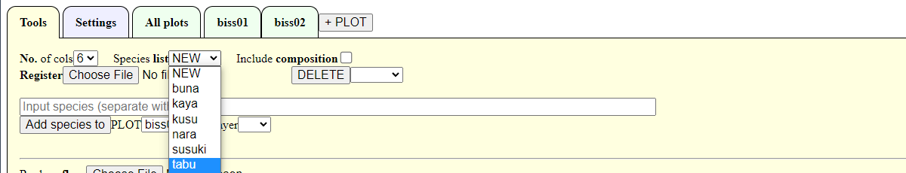

一覧に表示されている種名ボタンをクリックすると，その種名が仮登録として上の部分に移動する．
仮登録したものは，種名一覧ではクリックできなくなる．
仮登録した種名ボタンをクリックすると，仮登録がキャンセルされる．

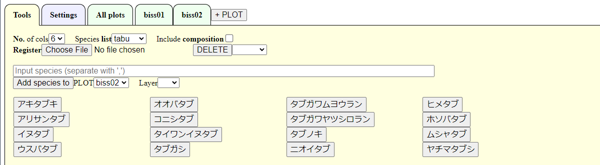

「No. of cols」の右にある数字を変更すると，種名の表示列数を変更できる．

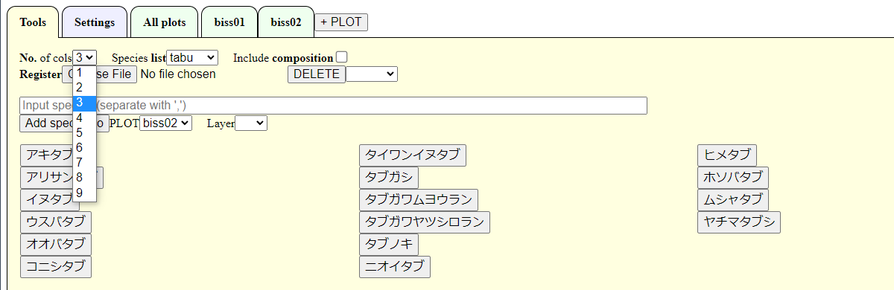

仮登録した種名について地点および階層をプルダウンメニューから選択する．
プルダウンメニューには，階層等のリスト形式の項目が表示される．
一度に複数地点・複数階層等には登録できない．
また，地点の選択は必須で，階層等は非必須．

種名ボタンのない種名は，テキストボックスから登録可能．
テキストボックスで複数種を登録するときには「,」(半角カンマ)で区切る．


「Add Species to」をクリックすると種名が観察情報に追加できる．
種名リストの仮登録の種は，種名一覧に戻る．

「Include composition」にチェックを入れると，全地点での入力済の種名が種名一覧に追加されて表示される．
未同定の種名(「Identified」にチェックされていない種)には，「sp8\_biss02」のような形式で地点名が合わせて表示される．

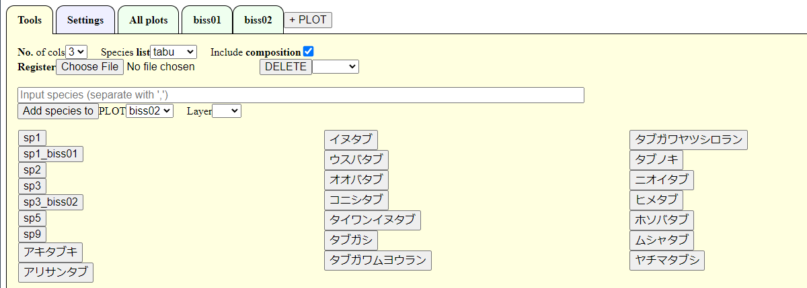

「sp8\_biss02」を選択して観察情報に追加すると，既出の地点名(この例では「biss02」)が「SameAs」の列にが自動的に入力される．

## 大規模な種名リスト

大規模な種名リストは，1000種あるいはそれ以上の規模を想定している．
出現頻度は低いが，出現する可能性のある種名を全て登録しておくと便利である．
つまり，使用する国や地域の全種の一覧を登録しておくのが良い．
1つしか登録できず，切り替えにはファイルの再読み込みが必要である．
登録種の一覧は画面上には表示されない．
テキストボックスで検索して，合致した種の一覧が表示される．
表示された種を選択すると，調査データとして入力できる．

### 種名リストの登録

種名はテキストファイル(UTF8)から登録可能．
テキストファイルは，1つの種名を1行ごとに入力しておく．
「Add species to list」の右にある「Choose file」でファイル名を選択し，「開く」をクリックする．


大規模な種名リストは1つしか登録できないため，新しいものを登録すると古いものは削除される．

### 種名の検索

大規模な種名リストは，文字列の検索が可能である．
「Input text」と薄く表示された検索用のテキストボックスに検索文字列を入力して「Search」をクリックすると，検索結果に合致する種が種名のボタンとして表示される．
合致したものが200種を超える場合は，「Over 200 matches, showing 200 matches」という警告がポップアップ画面で表示され，最初の200種のみが表示される．


複数の文字列をスペースで区切って入力すると，絞り込み検索が可能である(3項目以上でも検索可能)．
つまり，「アイ ガヤ」で検索すると，「アイ」かつ「ガヤ」に合致するものだけが表示される．
検索のテキストボックスを空欄にして「Search」をクリックすると，検索結果がリセットされて種名のボタンが消える．


調査データへの入力方法は，小規模リストと同様である．

# Rでのデータの取り込み

<!--
TODO: 
SameAsの種を同じ種として扱うようにする
-->

BiSSの[データ形式](https://github.com/matutosi/biodiv/blob/main/man/howtouse.md#data-format)は，JSON形式のテキストファイル(UTF8)である．
Rでデータを利用するには，read_biss()を利用するのと便利である．

```{r, eval=FALSE}
read_biss <- function(json, join = TRUE){
  biss <- jsonlite::fromJSON(json)
  plot <- data.frame(biss$plot)
  occ  <- data.frame(biss$occ)
  if(join){
    return(dplyr::left_join(plot, occ))
  }else{
    return(list(plot = plot, occ = occ))
  }
}

library(jsonlite)
url <- "https://raw.githubusercontent.com/matutosi/biodiv/main/man/example.json"
json <- readr::read_tsv(url, col_names = FALSE)$X1

read_biss(json)
read_biss(json, join = FALSE)

```
