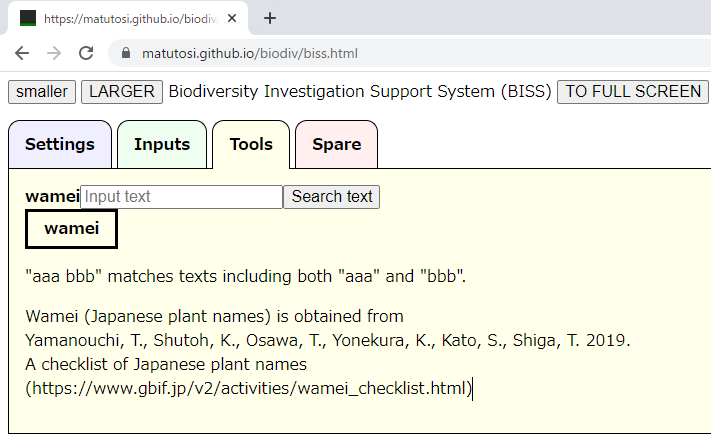
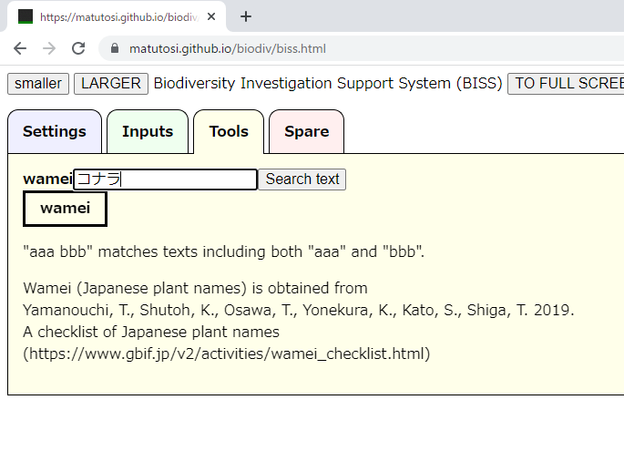
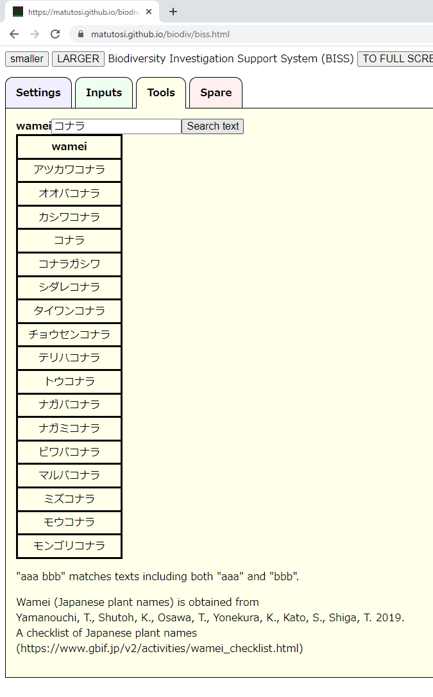
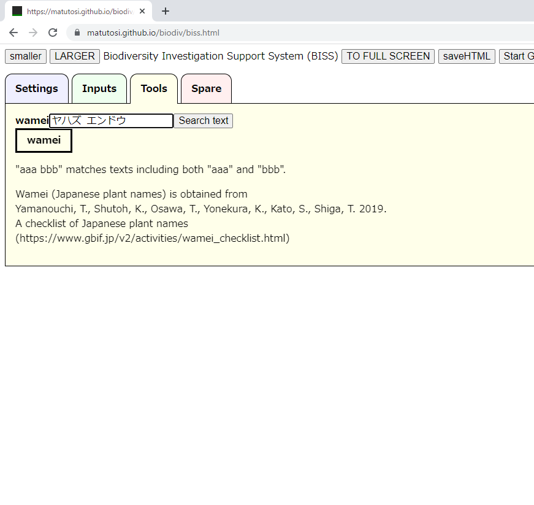
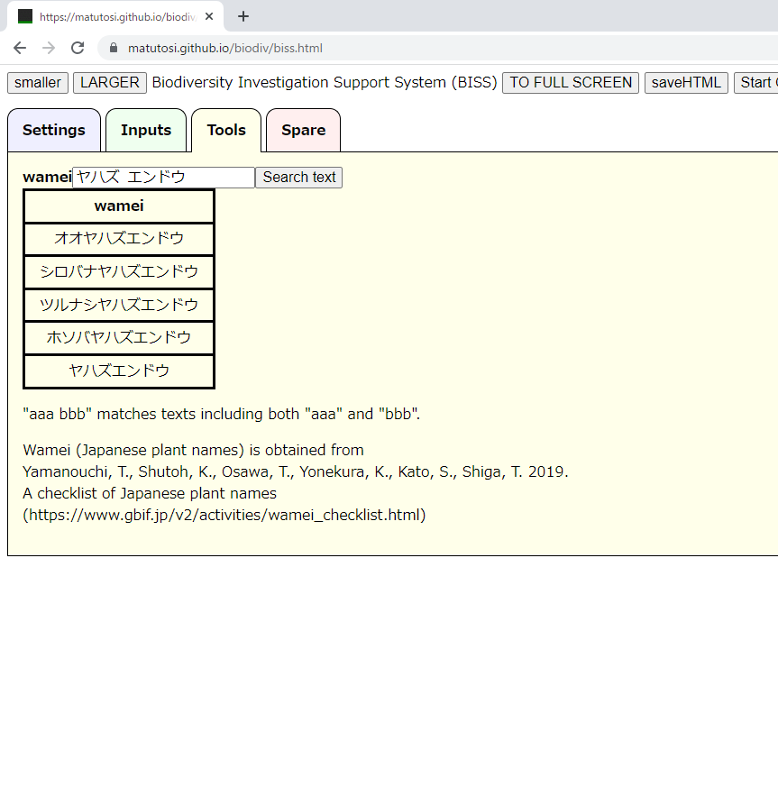
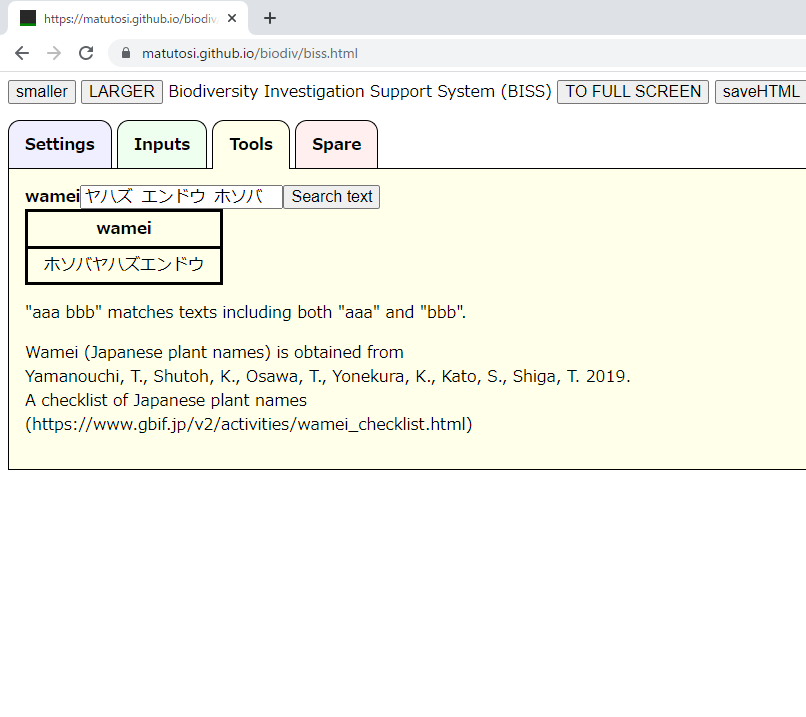
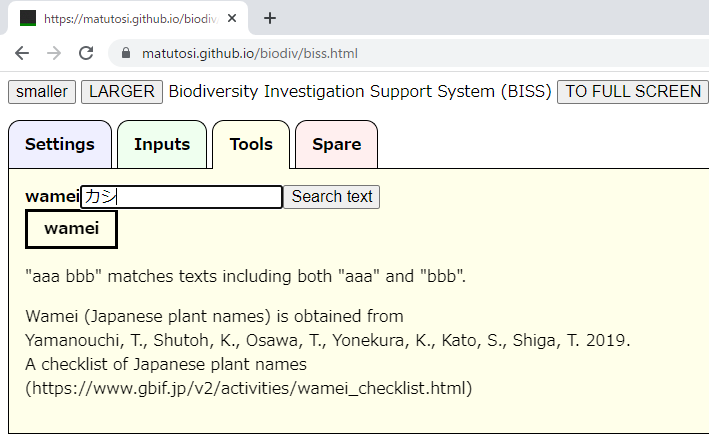
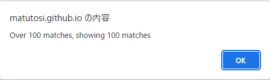
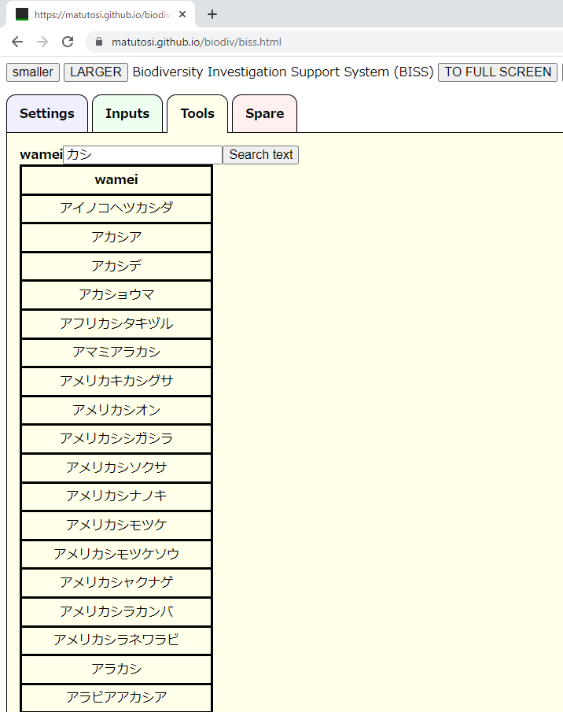
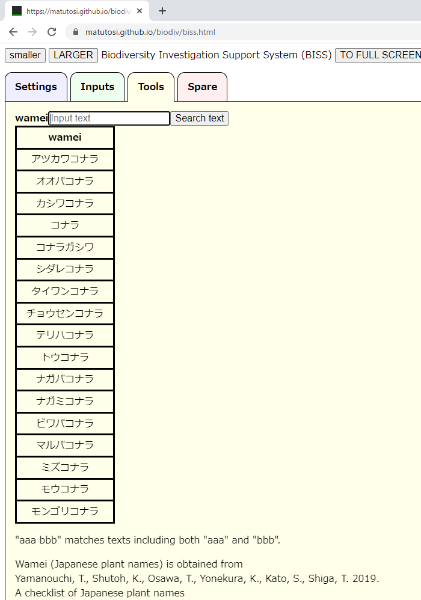

# How to use Investigation Support System (BISS)


## Settings

### 

  
  
  
  
  
  
  
  
  
  
  
  
  
  
  
  
  
  
  
  
  

  
  
  
  
  
  
  
  
  
  
  
  
  
  
  
  

## Input data


## Search wamei

- Choose "Tools" tab
    

- Input wamei and Choose "Search Text"  
- Show results  
  
  

- Use space (" ") to search including [A and B]  
- Results of [A and B]  
  
  

- Can use [A and B and C]  
  

- Case of results over 100  
- Alert will be desplayed and show only 100 results  
  
  
  

- 空欄でSearch Textを選択すると，検索結果がクリアされる  
  
  


## Inport data into R

```{r}
read_biss <- function(json, join = TRUE){
  biss <- jsonlite::fromJSON(json)
  plot <- data.frame(biss$plot)
  occ  <- data.frame(biss$occ)
  if(join){
    return(dplyr::left_join(plot, occ))
  }else{
    return(list(plot = plot, occ = occ))
  }
}

library(jsonlite)
url <- "https://raw.githubusercontent.com/matutosi/biodiv/main/man/example.json"
json <- readr::read_tsv(url, col_names = FALSE)$X1

read_biss(json)
read_biss(json, join = FALSE)


```


<!-- 
Basic use in a table
* Hide button: hide a col
* DELETE: delete a row
* Click col names: sort
* add row: copy last rows
* Search text: filter by text
* Hide/Show table
* Fit/Extend width to page
* Calculate cover
   in each layer
* Can add species from list
   by Add species to PLOT
-->
