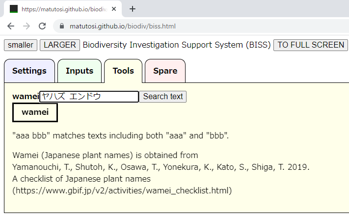

# How to use Investigation Support System (BiSS) 生物多様性調査支援アプリ(BiSS)の使い方

# Settings 設定

## Initial settings 初期画面

Initial settings is as below. 
Can use auto saving and select several setting for plots and occurrences. 

初期画面は以下のとおり．
自動保存や地点・観察の入力項目の設定が可能である．


## 文字サイズの変更


To change the font size of the entire screen, click "SMALLER" and "LAGER" buttons.
The size can be changed by approximately 0.83 (1/1.2) and 1.2 times, respectively.

「smaller」「LAGER」ボタンで画面全体の文字サイズの変更が可能．
それぞれ，約0.83(1/1.2)倍・約1.2倍になる．

## 全画面表示への変更

The browser is displayed in a normal window at startup. 
To prevent accidental termination of the application, full screen is recommended.
Click "FULL SCREEN <=> windowed" to switch between full-screen and windowed mode.

起動時のブラウザは，通常のウィンドウ表示である．
誤操作によるアプリの終了を防ぐには，全画面表示を推奨．
「FULL SCREEN <=> windowed」をクリックすると，ウィンドウ表示と全画面表示が入れ替わる．


## Use GPS GPSの使用

To use GPS data obtained by a tablet or computer, permission is required.
Click the "Use GPS" button, then a message for permission will be desplayed and click 'Allow'.
To stop GPS, click "Stop GPS".

端末で取得したGPS情報を入手するにはGPSの使用許可が必要．
「Use GPS」のボタンをクリックするとメッセージが表示されるので，「承諾」をクリックする．
GPSの使用を終了するには，「Stop GPS」をクリック．

## 電子メールアプリの起動

Enter an e-mail address and click "Launch mailer" to start the default e-mail application.
The default e-mail application can be set by your tablet or computer.

電子メールアドレスを入力し，「Launch mailer」をクリックすると既定の電子メールアプリを起動できる．
既定の電子メールアプリについては，端末で設定する．

- Subject: biss\_yyyy\_mm\_dd\_hh\_mm\_ss    
- Body: Survey data in JSON format    
- 件名: biss\_yyyy\_mm\_dd\_hh\_mm\_ss    
- 本文: JSON形式の調査データ    

To use the data in R, save the body of the email as text data.
For the subsequent operations, see "Inport data into R".

調査データをRで利用するには，メールの本文をテキストデータとして保存する．
その後の操作は，「Rでのデータの取り込み」を参照．

## Auto save 自動保存

Data can be saved at a interval (1, 3, 5, 10, 15, 30, 60 minutes). 
To enable automatic saving, the following settings should be set. 
This function continues to save a new file periodically. 
Therefore, a large number of files are saved at short intervals. 
Generally, it is recommended to save at intervals of 10 or 15 minutes. 

一定間隔(1,3,5,10,15,30,60分)で入力したデータを保存できる．
自動保存を有効にするには，以下の設定が必要．
一定間隔で保存を新しいファイルの保存を続ける．
そのため，短い間隔の場合は多くのファイルが保存される．
一般的には，10分や15分間隔程度での保存を推奨．

### Select auto save intervals 保存間隔の選択

Select auto save interval (minutes) form the pull-down menu.
After setting interval, all plots and occurrences data will be downloaded. 

自動保存の間隔(分)をプルダウンメニューから選択する．
保存間隔を設定すると，地点情報と観察情報の全てがダウンロードされる．


### Downloading the first data データのダウンロード開始

When set to 5-minute intervals, the first data will be downloaded 5 minutes after setting.
Directory for download depends on your browser settings.

5分間隔に設定した場合は，設定の5分後に1回目のデータがダウンロードされる．ダウンロード先のフォルダは，ブラウザの設定による．


### Allowing multiple file downloads 複数ファイルダウンロードの許可

During the second download of 10 minutes, a warning message may appear about allowing multiple files to be downloaded.
In this case, select "Allow".

2回目の10分後のダウンロード時に，複数ファイルのダウンロードの許可の警告が出る場合がある．
この場合は，「許可」を選択する．


### Auto saving data データの自動保存

Data is then downloaded according to the interval setting.

その後，設定した間隔に従ってデータがダウンロードされる．


### Data format データの形式

- file name ファイル名 :biss\_yyyy\_mm\_dd\_hh\_mm\_ss.json   
- format 形式: text file with UTF8 encoding  

<details>
<summary>
example

データ例

</summary>

> {"plot":{"PLOT":["biss01","biss02"],"NO":["1","2"],"DATE":["2022_12_08_20_56_33","2022_12_08_20_56_34"],"Investigator":["",""],"Location":["",""],"LOC_LAT":["undefined","undefined"],"LOC_LON":["undefined","undefined"],"LOC_ACC":["undefined","undefined"],"Altitude":["",""],"Aspect":["",""],"Inclination":["",""],"T1_height":["",""],"T2_height":["",""],"S1_height":["",""],"S2_height":["",""],"H_height":["",""],"T1_cover":["",""],"T2_cover":["",""],"S1_cover":["",""],"S2_cover":["",""],"H_cover":["",""],"Photo":["",""],"Memo":["",""]},"occ":{"PLOT":["biss01","biss01","biss01","biss01","biss01","biss01","biss02","biss02","biss02","biss02","biss02"],"Layer":["T1","T2","T1","T1","S1","S1","S1","S1","H","H","T2"],"Species":["sp1","sp3","sp7","sp4","sp4","sp9","sp1","sp9","sp5","sp7","sp7"],"Cover":["18","89","57","76","","99","","11","65","74","99"],"Sampled":["false","false","false","false","false","false","false","false","false","false","false"],"Identified":["false","true","true","true","true","true","false","true","true","true","true"],"Photo":["","","","","","","","","","",""],"Memo":["","","","","","","","","","",""],"SameAs":["","","","","","","","","","",""]}}
<summary>
</details>

### Inport data into R Rへのデータの取り込み

See "Inport data into R" to use data in R.

Rでデータを使うには，「Rでのデータの取り込み」を参照．


## Setting of input items 入力項目の設定

Before inputting data, the plot and occurrence items must be set.
The following three methods are available. 

データ入力の前に，地点情報と観察情報の項目を設定する．
設定方法としては以下の3つがある．

- Select a basic combination and add/delete items (recommended)   
- Start with the empty and add items with button (recommended)   
- Setting all items by yourself (not recommended)   
- 基本的な組み合わせを選んで，追加・削除する(推奨)   
- 空の設定に必要な項目をボタンで追加する(推奨)   
- 全て自分で設定する(非推奨)   

### Select a basic combination 基本的な組み合わせの選択

To select a basic combination and add/delete items, 
at first select the close setting to be used from pull-down menu.

基本的な組み合わせを選んで追加・削除する場合，まず使用するものに近い設定を選ぶ．

- empty: Empty settings
- full: Contains all items that might be needed in a vegetation survey or flora survey   
- \_5\_layers: For vegetation survey with 5 layers (T1, T2, S1, S2, H)   
- \_3\_layers: For vegetation survey with 3 layers (T, S, H)   
- no\_layers: For vegetation survey without layers   
- flora: For flora survey   

- empty: 空の設定    
- full: 植生調査や植物相調査で必要になりそうな項目を全て含む   
- \_5\_layers: 5階層(T1, T2, S1, S2, H)の植生調査用   
- \_3\_layers: 3階層(T, S, H)の植生調査用   
- no\_layers: 階層なしの植生調査用   
- flora: 植物相調査用   


For vegetation surveys, it is recommended to use "full" or "\_5\_layers". 
Delete unnecessary items with "DELETE" button. 

植生調査の場合は，「full」か「\_5\_layers」をもとにすることをおすすめする．
不要な行を「DELETE」で削除する．


If you can not find what you need, add rows by clicking "Add rows" at the bottom. 
To add multiple rows, change the values on the left and press "Add rows". 

必要な項目がない場合は，一番下の「Add rows」で行を追加する．
複数行を追加したい場合は，左の数値を変更してから「Add rows」を押す．


### Start with the empty and add with buttons 空の設定からボタンを追加

Start with the empty setting, select empty above. 
Add items with "date\_GPS" button etc. 

空の設定をもとに，必要な項目を追加する場合は，上記のemptyを選択する．
"date\_GPS"などのボタンで項目を追加する．


### Save/load settings 設定の保存・復元

The settings of plots and occurrences can be separately saved and restored. 
To save, enter a file name in the text box to the right of the "Save" button and click the "Save" button. 
The saved file is a text file in JSON format (UTF8) with the extension "json". 

地点項目と観察項目の設定は，個別に保存・復元可能．
保存するには「Save」の右にあるテキストボックスにファイル名を入力し，「Save」ボタンをクリックする．
保存したファイルはJSON形式のテキストファイル(UTF8)で，拡張子は「json」．


<details>
<summary>
settigs of no_layers

no_layersの設定
</summary>

> {"biss_c_names":["item","type","value","DELETE","memo"],"biss_d_types":["text","list","text","button","text"],"biss_selects":[null,["auto","button","checkbox","fixed","list","text","number","","","","","","","","","","","","","","",""],null,null,null],"biss_inputs":{"item":["DATE","Investigator","Location","LOC_LAT","LOC_LON","LOC_ACC","UPDATE_TIME_GPS","Altitude","Aspect","Inclination","Height","Cover","Photo","Memo"],"type":["auto","fixed","text","auto","auto","auto","button","number","text","number","number","number","text","text"],"value":["","","","","","","","","","","","","",""],"DELETE":["DELETE","DELETE","DELETE","DELETE","DELETE","DELETE","DELETE","DELETE","DELETE","DELETE","DELETE","DELETE","DELETE","DELETE"],"memo":["","","","","","","","","","","","","",""]}}
</details>

<details>
<summary>
settigs of flora

floraの設定
</summary>

> {"biss_c_names":["item","type","value","DELETE","memo"],"biss_d_types":["text","list","text","button","text"],"biss_selects":[null,["auto","button","checkbox","fixed","list","text","number","","","","",""],null,null,null],"biss_inputs":{"item":["DATE","Investigator","Location","Memo"],"type":["auto","fixed","text","text"],"value":["","","",""],"DELETE":["DELETE","DELETE","DELETE","DELETE"],"memo":["","","",""]}}
</details>

To restore the saved settings, click the "Choose file" button to the right of "Laod" and select the saved file.

保存した設定を復元するには，「Laod」の右側にある「Choose file」ボタンをクリックして，保存したファイルを選択する．


### Setting all items by yourself (not recommended) 全項目を手動で設定(非推奨)


<!--
設定方法やシステムの仕様の説明は未作成．
-->
<!-- 
TODO: 
Layerを使っているのは，ulModuleのaddRowsWithValuesのところ．
selectの項目を全て出すようにcodeを変更すれば，Layerを変更不可にしなくても大丈夫かも．
-->

> **Note**   
> All items can also be set manually.
> However, this is not recommended because it requires understandings of the system specifications.
> Explanation of the setting method and system specifications has not yet been prepared.

> **Note**   
> 全項目を手動で設定することも可能．
> ただし，システム仕様を理解する必要があるため，非推奨．


<details>
<summary>
Item details

項目の詳細
</summary>

- item: Item name   
  - Item names that cannot be changed: "DATE", "LOC\_LAT", "LOC\_LON", "LOC\_ACC", "UPDATE\_TIME\_GPS", "DELETE", "DATE", "Layer", "Species", "Identified", "SameAs".   
  - Disabled strings: numbers at the beginning   
  - Duplicate item names are not allowed.   
- type: Input type   
  - auto: Auto input (used by system), item name cannot be changed   
  - button: button (used by system), item name cannot be changed   
  - checkbox: Checkbox   
  - fixed: Fixed value text   
  - list: pull-down list   
  - text: Text box   
  - number: Numeric value   
- value: behavior depends on type   
  - checkbox: unchecked if empty, checked if input is present (text such as "checked" is recommended for clarity)  
<!--  
  - number: number of width of increase/decrease, 1 if empty   
-->
  - fixed: content of fixed value   
  - list: pull-down menu item names separated by ":".   
- DELETE: button to delete a row (not related to the setting itself)   
- memo: memo for user (not related to setting itself)    

- item: 項目名   
  - 変更不可の項目名: 「DATE」「LOC\_LAT」「LOC\_LON」「LOC\_ACC」「UPDATE\_TIME\_GPS」「DELETE」「DATE」「Layer」「Species」「Identified」「SameAs」   
  - 使用不可の文字列: 先頭での数字   
    <!-- 「,」「.」は不可? -->
  - 項目名の重複不可   
- type: 入力タイプ   
  - auto: 自動入力(システムで利用)，項目名の変更不可   
  - button: ボタン(システムで利用)，項目名の変更不可   
  - checkbox: チェックボックス   
  - fixed: 固定値のテキスト   
  - list: プルダウンリスト   
  - text: テキストボックス   
  - number: 数値   
- value: typeによって動作が異なる   
  - checkbox: 空のときはチェックなし，入力があるときはチェックあり(分かりやすくするため，「checked」などのテキストを推奨)  
<!-- 
  - number: 増減幅の数値，空のときは1   
TODO:  code変更の必要あり
-->
  - fixed: 固定値の内容   
  - list: 「:」区切りでのプルダウンメニューの項目名   
- DELETE: 行の削除ボタン(設定自体には関係なし)   
- memo: 使用者用のメモ(設定自体には関係なし)    
</details>

### Hide/Show setting tables 設定表の表示・非表示

The setting tables can be set shown or hidden.
To avoid accidental change of the settings, it is recommended to hide them.

Press "Hide table" in the upper left corner to hide it.
When the table is hidden, press "Show table" to display it.

地点項目と観察項目の表は，表示/非表示の切り替えが可能．
それぞれを設定後に，間違えて設定を変更しないようにするには，非表示にしておくと良い．

表の左上ににある「Hide table」を押すと，非表示になる．
非表示のときに，「Show table」を押すと，表示される．


### Tips for setting items 項目設定のコツ

The horizontal order (left/right) of items in input tables depend on the vertical order (up/down) in setting tables. 
To change the order, enter a numbr in the "memo" field and click on the column name "memo". 
This will allow you to reorder the columns according to the number. 
Clicking again switches the ascending/descending order.

調査データの入力表での横並びの順序(左右)は，設定表の縦並びの順序(上下)に従う．
順序を並べ替えたい場合は，入力表の項目「memo」に数値を入力してから列名の「memo」をクリックする．
そうすることで，入力した数値の順序に並べ替え可能．
さらにクリックすると，昇順・降順が入れ替わる．

# Input plot and occurrence data 地点情報と観察情報の入力

## Add a new plot 新しい地点の追加

Before entering plot and occurrence data, click on "+ PLOT".
Enter the PLOT name in the pop-up window. 
Alphanumeric and Japanese characters can be used for the PLOT name. 

地点情報と観察情報を入力するには，まず「+ PLOT」をクリックする．
ポップアップ画面に地点名を入力する．
地点名には，英数字・日本語文字が使用可能．


> **Warning**   
> Only spaces and "\_" (underscore) are not allowed.
> Duplicate PLOT names are not allowed.

> **Warning**   
> 空白のみや「\_」(アンダーバー)は使用不可．
> また，地点名の重複はできない．

<!-- 
ポップアップの画面を追加する
-->

In the following sections, you can see how to input plot and occurrence data with example.

以下では，サンプルデータを用いて地点情報と観察情報の入力方法を説明する．

## Show example サンプルデータの表示

Click "Show example" in the upper right corner to display example data.

右上にある「Show example」をクリックすると，サンプルデータが表示される．


表の上部には地点情報，下部には観察情報の表が表示される．

## Contents of example data サンプルデータの内容

- Settings of the plot and occurrence items: "\_5\_layers" (for vegetation survey with 5 layers).   
- Plots: 2 plots (BiSS01 and BiSS02)  
- Occurrences: Randomly displays the layers (T1, T2, S1, S2, H), species (sp1, sp2, ...) and cover (0-100). 
- サンプルデータでの地点項目と観察項目: 「\_5\_layers」(5階層の植生調査用)．   
- Plots: BiSS01とBiSS02の2地点   
- Occurrences: ランダムに階層(T1, T2, S1, S2, H)，種名(sp1, sp2, ...)，被度(0-100)が表示される


## Table display changes and operations (common to plot and occurrence) 表の表示変更・操作(地点・観察共通)

Can operate the table of plot and occurrence. 

地点情報と観察情報の表は以下の操作が可能．

- Show/hide the table   
- Change table width  
- Show/hide columns   
- Sort rows   
- Search input text   
- 表の表示/非表示   
- 表幅の変更  
- 列の表示/非表示   
- 行の並べ替え   
- テキストデータの検索   

### Show/hide the table 表の表示/非表示   

Both the plot and occurrence tables can be displayed or hidden.
To prevent accidental changes, it is recommended to hide the table.
Press "Hide table" in the upper left corner of the table to hide the table.
When the table is hidden, pressing "Show table" will show it.

地点情報と観察情報の両方とも，表示/非表示の切り替えが可能．
誤操作による変更を防ぐには，非表示にしておくと良い．
表の左上ににある「Hide table」を押すと，非表示になる．
非表示のときに，「Show table」を押すと，表示される．

### Change table width 表幅の設定変更  

The initial state of the plot table is wrapped to fit the screen width, while the occurrence table is extended to the right without wrapping.
Clicking on "Extend width" in the upper left corner of the table expands the width of the table without wrapping.
Clicking on "Fit width" will wrap the table to fit the screen width .

地点情報の初期状態は画面幅に合わせた形で折り返され，観察情報は折り返しなしで右に伸びた状態である．
表の左上にある「Extend width」をクリックすると，表幅が広がって折り返しなしの状態になる．
「Fit width」をクリックすると，画面幅で折り返される．

### Show/hide columns 列の表示/非表示   

In a no-wrap table, the "Hide" button appears in the second row.
Clicking the "Hide" button hides the column.
The hidden column names are displayed at the top of the table following "Show".
Clicking the button for each column name allows the column to be displayed again.
Click "All cols" to display all columns at once.

折り返しなしの状態のとき，表の2行目に「Hide」ボタンが表示される．
「Hide」ボタンをクリックすると，その列が非表示になる．
非表示になった列は，表の上部に「Show」に続いて列名がボタンとして表示される．
それぞれの列名のボタンをクリックすると，再表示が可能．
「All cols」をクリックすると全列を一斉に表示できる．

### Sort rows 行の並べ替え

Clicking on a column name in the "no wrap" state allows sorting according to the input contents of the column.
Clicking the column name again switches the ascending or descending order.

折り返しなしの状態のときに列名をクリックすると，その列の入力内容に従って並べ替えができる．
再度列名をクリックすると，昇順・降順が入れ替わる．

Note that sorting is meaningless for the plot data, since there is only one row.

なお，1地点での地点情報では1行しかないため，並べ替えは無意味．


### Search input text テキストデータの検索

Entering text in the text box in the upper left corner of the table allows you to search for text inputs.
Only matched rows are displayed, so you can check the species name etc.
The search targets here are the text boxes and fixed value text in the displayed columns.
To exclude the name of a plot from the search, you can hide it by clicking "Hide".

表の左上のテキストボックスに入力をすると，表示中の入力情報の検索が可能．
一致するものだけが表示されるため，種名の確認などができる．
なお，ここでの検索対象は，表示されている列のテキストボックス・固定値(fixed)のテキストである．
検索対象から地点名などを除外する場合は，「Hide」により非表示にしておくと良い．

## データ入力

- Textbox: Enter text, e.g., species name   
- Checkbox: Check "Identified   
- Numer: Enter a number. Decimal points can be entered using the keyboard.    
- Auto-fill items: "PLOT", "NO", "DATE", "LOC".    
- DATE", "LOC\_LAT", "LOC\_LON" and "LOC\_ACC" are updated by pressing "UPDATE\_TIME\_GPS" button.     

- テキストボックス: 種名などをテキストで入力   
- チェックボックス: 「Identified」(同定済み)をチェック   
- 数値: 数値を入力．△▽では1単位で増減．キーボードでは小数点以下の入力可能    
- 自動入力項目: 「PLOT」「NO」    
- 「DATE」「LOC\_LAT」「LOC\_LON」「LOC\_ACC」は，「UPDATE\_TIME\_GPS」ボタンを押と更新．GPSデータは，「StartGPS」ボタンを押してGPSデータの使用を許可する必要あり．     

## 観察情報の行の追加・削除

When a new location is added with "+ PLOT", four lines of occurrence rows are displayed.
Select the number of rows from the pull-down number in the lower left corner, 
and click "Add rows" to add a new input row.

「+ PLOT」で新規の地点を追加すると，観察情報は4行の入力欄が表示される．
左下のプルダウンの数字で行数を選択して，「Add rows」をクリックすると，新たな入力行が追加できる．

# editing now


## Add species from a list リストから種名を追加

観察情報の表の種名一覧が表示される．
一覧に表示されている種名ボタンをクリックすると，その種名が仮登録として上の部分に移動する．
仮登録したものは，種名一覧ではクリックできない状態になる．
仮登録した種名について地点および階層をプルダウンメニューから選択して，
「Add Species to PLOT」をクリックすると種名を選択した地点・階層に追加できる．
なお，一度に複数地点・複数階層には登録できない．
また，地点の選択は必須で，階層は非必須．

種名ボタンのない種名は，テキストボックスから登録可能．
テキストボックスで複数種を登録するときには，「,」(半角カンマ)で区切る．

仮登録した種名ボタンをクリックすると，仮登録がキャンセルされる．


未同定の種名(「Identified」にチェックされていない種)には，「種名\_地点A」のような形式で地点名が合わせて表示される．
その種名を選択して，観察情報として追加すると，SameAsの列に既出の地点名(上記の例では「地点A」)が自動的に入力される．


また，全地点での入力済の種名も合わせてリストに表示される．
種名リストの追加・削除は，「Tools」の「○○」を参照．


## 階層ごとの被度の計算

Select "Cover" for "Value" and "Layer" for "Group" in the lower left of the occurrence table, 
and click "Calculate" to display the result of calculating sum of cover for each layer.
Note that "Value" displays number items in the occurrence data, and "Group" pull-down list. 
Thus, it is possible to calculate other than "Cover" and "Layer".

観察情報の左下にある「Value」に「Cover」，「Group」に「Layer」を選択して，「Calculate」をクリックすると，階層ごとの被度を計算した結果が表示される．
なお，「Value」には観察情報のうち数値の項目が表示され，「Group」にはプルダウンのリストの項目が表示される．
そのため，「被度」「階層」以外の集計も可能．


## 未作成


# Show all inputs 全入力情報の表示

「All Plots」のタブには，入力済みの全データが表示されている．
具体的には，全ての地点情報と観察情報である．
また，組成表形式の表も表示される．
これらによって，地点情報や地点間での観察情報の比較ができる．
なお，「All Plots」の表は閲覧のみで，内容の変更は不可．

「All Plots」の3つの表のいずれも，地点情報や観察情報の表と同様に以下の操作が可能である．

- 表の表示/非表示   
- 表の幅の設定変更  
- 列の表示/非表示   
- 行の並べ替え   
- テキストデータの検索   

詳細は，「地点情報と観察情報の入力」の「表の表示変更・操作」を参照．

内部的なことではあるが，自動保存機能で保存しているのは「All Plots」のデータである．

# Tools 

種名の検索，種名リストの作成・保存などができる．
また，検索した種名やリストからデータ入力が可能である．

種名リストはテキストファイル(UTF8)から登録可能．
テキストファイルは，1つの種名を1行ごとに入力しておく．
「Add species to list」の右にある「Choose file」でファイル名を選択し，「開く」をクリックする．

テキストファイル内の種名がボタン形式で表示される．
表示されている種名を使用している端末のブラウザ内に名前をつけて保存可能．
保存先として「browser」を選択して，「File name」にリストの名称を入力し，「Save」ボタンをクリックするとブラウザに保存される．

種名リストとして登録すると，
「Select species list:」の右側にあるプルダウンメニュー内に追加される．
リストを選択すると，


<!-- TODO: 入力済みの種名を含めるかどうか選択することができれば便利かも -->
<!-- TODO: 種名リストの削除機能が必要 -->

> **Warning**   
> 種名リストの保存にはブラウザのLocalStorageを利用している．
> LocalStorage内の情報は，ブラウザでのサイト閲覧時「容易に」他者に漏洩する可能性がある．
> そのため，通常保存することはないはずだが，個人情報等は種名リスト(LocalStorage)には保存するべきではない．

## Search species name 種名の検索


- Choose "Tools" tab
    

- Input wamei and Choose "Search Text"  
- Show results  
  
  

- Use space (" ") to search including [A and B]  
- Results of [A and B]  
  
  

- Can use [A and B and C]  
  

- Case of results over 100  
- Alert will be desplayed and show only 100 results  
  
  
  

- 空欄でSearch Textを選択すると，検索結果がクリアされる  
  
  


# Inport data into R Rでのデータの取り込み

```{r}
read_biss <- function(json, join = TRUE){
  biss <- jsonlite::fromJSON(json)
  plot <- data.frame(biss$plot)
  occ  <- data.frame(biss$occ)
  if(join){
    return(dplyr::left_join(plot, occ))
  }else{
    return(list(plot = plot, occ = occ))
  }
}

library(jsonlite)
url <- "https://raw.githubusercontent.com/matutosi/biodiv/main/man/example.json"
json <- readr::read_tsv(url, col_names = FALSE)$X1

read_biss(json)
read_biss(json, join = FALSE)

```


<!--
- Toolsタブを選択  
- wameiに検索したい和名を入力して，Search Textを選択すると，検索結果が表示される  
- 「A かつ Bを含む」で検索したいときは，スペースで区切る  
- 「ヤハズ かつ エンドウを含む」の結果  
- 「A かつ B かつ C」も可能  
- 検索結果が100を超える場合(例：「カシ」)  
- 100を超えることの警告が表示され，結果は100個だけ表示  
- 空欄でSearch Textを選択すると，検索結果がクリアされる  

Basic use in a table
* Hide button: hide a col
* DELETE: delete a row
* Click col names: sort
* add row: copy last rows
* Search text: filter by text
* Hide/Show table
* Fit/Extend width to page
* Calculate cover
   in each layer
* Can add species from list
   by Add species to PLOT
-->
<!--  -->
