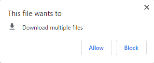

# How to use Investigation Support System (BISS)

## Settings 設定

### Initial settings 初期画面

Initial settings is as below. 
Can use auto saving and select several setting for plots and occurrences. 

初期画面は以下のとおり．
自動保存やプロット・観察データの設定が可能である．


### Auto save

Select auto save interval (minutes). 
After setting interval, all plots and occurrences data will be downloaded. 
Directory for download depends on your browser settings.

自動保存の間隔(分)を選択する．
保存間隔を設定すると，プロット情報と観察情報の全てがダウンロードされる．
ダウンロード先のフォルダは，ブラウザの設定による．


5分間隔に設定した場合は，設定後5分後に1回目のデータがダウンロードされる．
When set to 5-minute intervals, the first data will be downloaded 5 minutes after setting.


During the second download of 10 minutes, a warning may appear about allowing multiple files to be downloaded.
In that case, select "Allow".

10分の2回目のダウンロード時には，複数ファイルのダウンロードの許可の警告が出る場合がある．
その場合は，「許可」を選択する．



Data is then downloaded according to the interval setting.

その後，設定した間隔に従ってデータがダウンロードされる．


自動保存したデータのファイル名は以下のとおり．

yyyy_mm_dd_hh_mm_ss.json

データは，JSON形式のテキストファイル(UTF-8)．
データをRで読み込むには，「Rでのデータの取り込み」の項目を参照．


Inport data into R 


### Setting of input items 入力項目の設定

データを入力する前に，地点情報と観察情報の項目を設定する．

- 基本的な組み合わせを選んで，微調整する(推奨)   
- 空の設定をもとに，必要な項目を追加する(推奨)   
- 全て自分で設定する(非推奨)   

基本的な組み合わせを選んで，微調整する場合，まず使用する近い設定を選ぶ．
- empty: 空の設定
- full: 植生調査や植物相調査で必要になりそうな項目を全て含む   
- _5_layers: 5階層(T1, T2, S1, S2, H)の植生調査用   
- _3_layers: 3階層(T, S, H)の植生調査用   
- no_layers: 階層なしの植生調査用   
- flora: 植物相調査用   

まずは，fullか_5_layersをもとにするのが良い．
項目がない場合は，一番下の「Add rows」で行を追加する．
複数行を追加したい場合は，左の数値を変更してから「Add rows」を押す．


調査データの入力表での横並びの順序(左右)は，設定表の縦並びの順序(上下)に従う．
入力表での順序を並び替えたい場合は，「memo」の項目に数値を入力してから列名の「memo」をクリックする．
そうすることで，入力した数値の順序に並び替え可能．
さらにクリックすると，昇順・降順が入れ替わる．


空の設定をもとに，必要な項目を追加する場合は，上記のemptyを選択する．
その後，


## Use example サンプルデータを使ってみる


## Input data


## Search wamei


- Choose "Tools" tab
    

- Input wamei and Choose "Search Text"  
- Show results  
  
  

- Use space (" ") to search including [A and B]  
- Results of [A and B]  
  
  

- Can use [A and B and C]  
  

- Case of results over 100  
- Alert will be desplayed and show only 100 results  
  
  
  

- 空欄でSearch Textを選択すると，検索結果がクリアされる  
  
  


## Inport data into R Rでのデータの取り込み

```{r}
read_biss <- function(json, join = TRUE){
  biss <- jsonlite::fromJSON(json)
  plot <- data.frame(biss$plot)
  occ  <- data.frame(biss$occ)
  if(join){
    return(dplyr::left_join(plot, occ))
  }else{
    return(list(plot = plot, occ = occ))
  }
}

library(jsonlite)
url <- "https://raw.githubusercontent.com/matutosi/biodiv/main/man/example.json"
json <- readr::read_tsv(url, col_names = FALSE)$X1

read_biss(json)
read_biss(json, join = FALSE)


```


<!-- 
Basic use in a table
* Hide button: hide a col
* DELETE: delete a row
* Click col names: sort
* add row: copy last rows
* Search text: filter by text
* Hide/Show table
* Fit/Extend width to page
* Calculate cover
   in each layer
* Can add species from list
   by Add species to PLOT
-->
