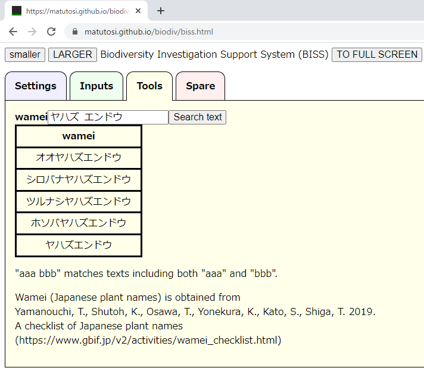

# How to use Investigation Support System (BISS)


## Settings 設定

### Initial settings 初期画面

Initial settings is as below. 
Can use auto saving and select several setting for plots and occurrences. 

初期画面は以下のとおり．
自動保存やプロット・観察データの設定が可能である．


### Auto save 自動保存

#### Select auto save intervals 保存間隔の選択

Select auto save interval (minutes) form the pull-down menu.
After setting interval, all plots and occurrences data will be downloaded. 

自動保存の間隔(分)をプルダウンメニューから選択する．
保存間隔を設定すると，プロット情報と観察情報の全てがダウンロードされる．


#### Downloading the first data データのダウンロード開始

When set to 5-minute intervals, the first data will be downloaded 5 minutes after setting.
Directory for download depends on your browser settings.

5分間隔に設定した場合は，設定の5分後に1回目のデータがダウンロードされる．ダウンロード先のフォルダは，ブラウザの設定による．


#### Allowing multiple file downloads 複数ファイルダウンロードの許可

During the second download of 10 minutes, a warning may appear about allowing multiple files to be downloaded.
In that case, select "Allow".

2回目の10分後のダウンロード時に，複数ファイルのダウンロードの許可の警告が出る場合がある．
その場合は，「許可」を選択する．


#### Auto saving data データの自動保存

Data is then downloaded according to the interval setting.

その後，設定した間隔に従ってデータがダウンロードされる．


#### Data format データの形式

- file name ファイル名 :yyyy\_mm\_dd\_hh\_mm_ss.json   
- format 形式: text file with utf8 encoding  


#### Inport data into R Rへのデータの取り込み

See "Inport data into R" to use data in R.

Rでデータを使うには，「Rでのデータの取り込み」を参照．


### Setting of input items 入力項目の設定

データを入力する前に，地点情報と観察情報の項目を設定する．

- Select a basic combination and add/delete items (recommended)   
- Start with the empty and add items with botton (recommended)   
- Set up everything by yourself (deprecated)   
- 基本的な組み合わせを選んで，追加・削除する(推奨)   
- 空の設定に必要な項目をボタンで追加する(推奨)   
- 全て自分で設定する(非推奨)   

#### Select a basic combination 基本的な組み合わせの選択

To select a basic combination and add/delete items, 
at first select the close setting to be used from pull-down menu.

基本的な組み合わせを選んで追加・削除する場合，まず使用する近い設定を選ぶ．

- empty: Empty configuration
- full: Contains all items that might be needed in a vegetation or flora survey   
- \_5\_layers: For vegetation survey with 5 layers (T1, T2, S1, S2, H)   
- \_3\_layers: For vegetation survey with 3 layers (T, S, H)   
- no\_layers: For vegetation survey without layers   
- flora: For flora survey   

- empty: 空の設定    
- full: 植生調査や植物相調査で必要になりそうな項目を全て含む   
- \_5\_layers: 5階層(T1, T2, S1, S2, H)の植生調査用   
- \_3\_layers: 3階層(T, S, H)の植生調査用   
- no\_layers: 階層なしの植生調査用   
- flora: 植物相調査用   


For vegetation surveys, it is recommended to use "full" or "_5_layers".
If you do not see what you need, add rows by clicking "Add rows" at the bottom.
If you want to add multiple rows, change the values on the left and press "Add rows".

植生調査の場合は，「full」か「_5_layers」をもとにすることをおすすめする．
必要な項目がない場合は，一番下の「Add rows」で行を追加する．
複数行を追加したい場合は，左の数値を変更してから「Add rows」を押す．


空の設定をもとに，必要な項目を追加する場合は，上記のemptyを選択する．
その後，


#### Tips for setting items 項目設定のコツ

The horizontal item order (left/right) in input tables follow the vertical order (up/down) in setting tables. 
To change the order in a setting table, enter a numbr in the "memo" field and click on the column name "memo". 
This will allow you to reorder the columns according to the number. 
Clicking again switches the ascending/descending order.

調査データの入力表での横並びの順序(左右)は，設定表の縦並びの順序(上下)に従う．
入力表での順序を並び替えたい場合は，「memo」の項目に数値を入力してから列名の「memo」をクリックする．
そうすることで，入力した数値の順序に並び替え可能．
さらにクリックすると，昇順・降順が入れ替わる．

## Use example サンプルデータを使ってみる


## Input data


## Search wamei


- Choose "Tools" tab
    

- Input wamei and Choose "Search Text"  
- Show results  
  
  

- Use space (" ") to search including [A and B]  
- Results of [A and B]  
  
  

- Can use [A and B and C]  
  

- Case of results over 100  
- Alert will be desplayed and show only 100 results  
  
  
  

- 空欄でSearch Textを選択すると，検索結果がクリアされる  
  
  


## Inport data into R Rでのデータの取り込み

```{r}
read_biss <- function(json, join = TRUE){
  biss <- jsonlite::fromJSON(json)
  plot <- data.frame(biss$plot)
  occ  <- data.frame(biss$occ)
  if(join){
    return(dplyr::left_join(plot, occ))
  }else{
    return(list(plot = plot, occ = occ))
  }
}

library(jsonlite)
url <- "https://raw.githubusercontent.com/matutosi/biodiv/main/man/example.json"
json <- readr::read_tsv(url, col_names = FALSE)$X1

read_biss(json)
read_biss(json, join = FALSE)

```


<!-- 
Basic use in a table
* Hide button: hide a col
* DELETE: delete a row
* Click col names: sort
* add row: copy last rows
* Search text: filter by text
* Hide/Show table
* Fit/Extend width to page
* Calculate cover
   in each layer
* Can add species from list
   by Add species to PLOT
-->
