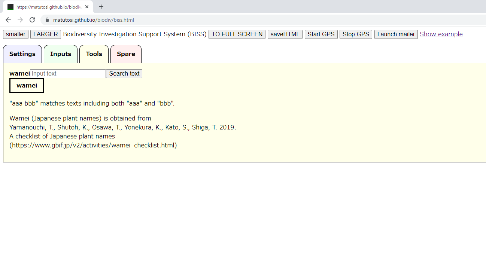

# 生物多様性調査支援アプリ(BISS)の使い方

## 設定

## 入力

## 和名の検索

- Toolsタブを選択  
  

- wameiに検索したい和名を入力して，Search Textを選択  
  

- 検索結果が表示される  
  

- 「A かつ Bを含む」で検索したいときは，スペースで区切る  
  

- 「ヤハズ かつ エンドウを含む」の結果  
  

- 「A かつ B かつC」も可能  
  

- 検索結果が100を超える場合(例：「カシ」)  
  

- 100を超えることの警告  
  

- 100を超えるときは，100個だけ表示  
  

- 空欄でSearch Textを選択すると，検索結果がクリアされる  
  
